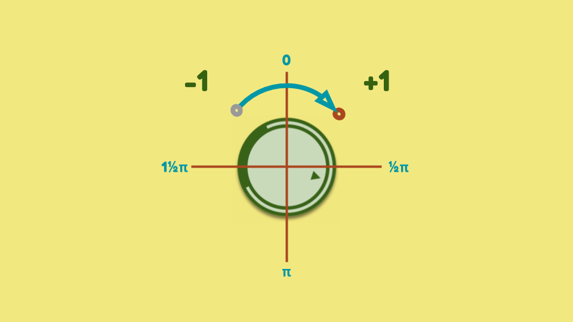

_This is the second in a series of posts detailing how I built the_ [🥑 _Rotavo PWA_](https://bit.ly/rotavo-pwa)_. Give it a whirl and see what you can draw!_

In the [previous instalment](https://dev.to/rowan_m/you-spin-me-right-r-und-k32) we built the touch-controlled `<input-knob>` component that let us create a rotating knob with a `value` attribute corresponding to its angle. However, [fun](https://rowan.fyi/made/paul-spinlan) as that might have been it's still missing some functionality to be practical for general use.

## Contents

 - [♻️ Freshen up](#freshen-up)
 - [👂 Quite the event](#quite-the-event)
 - [🔒 Enforcing limits](#enforcing-limits)
 - [🧛‍♂️ Count rotations](#count-rotations)
 - [🎁 Bonus content](#bonus-content)

## ♻️ Freshen up

First though, let's freshen up [the previous demo](https://rowan.fyi/made/building-rotavo-04/) with a few cosmetic improvements. I said we were going to build something that resembled a volume control knob on a stereo. Now, we got the rotating behaviour in there but our knob was square... traditionally they're round. You were all kind enough not to mention that, but we should fix that before we move on.

We also want an indicator for which way is "up" on our knob. As we saw in the [final demo](https://rowan.fyi/made/paul-spinlan) last time, we can just add any content we need inside the element. So we'll drop in a little triangle indicator there:

```html
<input-knob value="2.5"><div class="mark">▲</div></input-knob>

```

We then need to style that so it's central:

```css
.mark {
  display: inline-block;
  width: 100%;
  text-align: center;
  font: bold 200% monospace;
  color: #356211;
}
```

The primary change on the control is using `border-radius` to round off those corners. We're also going to put the shadow on the outer `input-knob` element as that does not rotate. If we had the shadow on the inner `::part(container)` it looks as if the shadow moves around the element instead, which is not the effect we're after.

```css
input-knob {
  border-radius: 100%;
  box-shadow: 0 0.3rem 0.3rem rgba(0, 0, 0, 0.5);
}
  
input-knob::part(container) {
  box-sizing: border-box;
  background: #cadbbc;
  border: 1rem double #356211;
  border-bottom: 1rem solid #356211;
  border-radius: 100%;
  width: 8rem;
  height: 8rem;
}
```

Rounded corners! The original CSS holy grail - revel in it.

<iframe src="https://rowan.fyi/made/building-rotavo-04" class="glitch"></iframe>

There is also a little improvement we can make to the styling of `:host` on our Shadow DOM template as well. Specifically, we want the cursor to change into the little 👆 pointer indicating to the user they can interact with it.

```css
:host {
  display: inline-block;
  user-select: none;
  touch-action: none;
  cursor: pointer;
}
```

## 👂 Quite the event

Now we've added a little polish to our element, we've got something visually pleasing but it's hard to react to any changes when the user interacts with the element. In the same way that we listen for Pointer events inside the element, we want to emit our own events in order to respond to them in the wider application.

Much like the Pointer events, we want to track the beginning, middle, and end of the interaction. That means we will [create three `Event`](https://developer.mozilla.org/en-US/docs/Web/Guide/Events/Creating_and_triggering_events) types:

  * `knob-move-start`: when the element is touched / clicked
  * `knob-move-change`: when the element is moved
  * `knob-move-end`: when the element is released

We're going to emit these events at the end of each handler inside of the element, because we want to be sure that we've done all the necessary work inside the element before anything attempts to process the event.

```javascript
// class InputKnob
_rotationStart() {
  // ✂️ existing code hidden      
  const evt = new Event('knob-move-start', { bubbles: true });
  this.dispatchEvent(evt);
}

_rotationChange() {
  // ✂️ existing code hidden    
  const evt = new Event('knob-move-change', { bubbles: true });
  this.dispatchEvent(evt);
}

_rotationEnd() {
  // ✂️ existing code hidden
  const evt = new Event('knob-move-end', { bubbles: true });
  this.dispatchEvent(evt);
}
```

Note, we need to make sure we specify `bubbles: true` because our [listener is going to be a parent element](https://developer.mozilla.org/en-US/docs/Learn/JavaScript/Building_blocks/Events#Event_bubbling_and_capture). You can try removing this and you'll see the event never "bubbles up" to the parent nodes.

With these events firing, we can listen for them just like any other:

```javascript
document.addEventListener('knob-move-start', logEvent);
```

Take a peek at the demo below to see how we're using the `logEvent()` function to light up some `<span>` elements when the events fire. 

<iframe src="https://rowan.fyi/made/building-rotavo-05" class="glitch"></iframe>

## ⚖️ Have some sense of proportion

Currently the `value` of the element maps directly to its angle. If we had a volume control that went from, say, 0 to 11 then that's what we want the value to match. Otherwise we're forcing our developer to do the conversion from the angle to the value themselves, which is just rude. To address this, we'll add a `scale` attribute where our developer can specify the value for a full rotation.

First, let's add that new attribute to the element. We want the usual attribute-to-property mirroring, however a little note - our default value is `1` as `scale` will be a multiplier and multiplying by `0` will always give us... well, `0` again. Let's drop that in:

```javascript
// class InputKnob
static get observedAttributes() {
  return ['value', 'scale'];
}

get scale() {
  return this.hasAttribute('scale') ? this.getAttribute('scale') :1;
}

set scale(scale) {
  this.setAttribute('scale', scale);
}
```

However now `value` and `_angle` are dependent on `scale`, so we have a bit of linking up to do. Whenever one of our attributes changes, we need to make sure we recalculate:

```javascript
attributeChangedCallback(attrName, oldVal, newVal) {
  this._angle = (TWO_PI / this.scale) * (this.value % this.scale);
  this._drawState();
}
```

So, if our `scale` is 10 and our `value` is 5, then that should be half a rotation on the knob - or an `_angle` of π - or pointing straight down.

The matching part is now when the `_angle` changes, we also need to update the `value`.

```javascript
// _rotationChange()
this.value = this._angle / (TWO_PI / this.scale);
```

So, to reverse what we had above if the angle comes out at π then we should expect a value of 5. That's... well, that's actually it for adding scale. So, you can verify that in the demo below. We've set the scale to 10, so ⬆️ = 0, ➡️ = 2.5, ⬇️ = 5, ⬅️ = 7.5. Give it a 🔃 below!

<iframe src="https://rowan.fyi/made/building-rotavo-06" class="glitch"></iframe>

As a little bonus, take a peek at the CSS in this demo. The layout uses a CSS Grid layout with `grid-template-areas` where you basically draw a little text diagram of the layout you want. So, the arrangement of the items above is literally:

```css
grid-template-areas: 
  ".  ⬆️ . "
  "⬅️ 🎛️ ➡️"
  ".  ⬇️ . ";
```

Would I recommend this in production? Who knows... I mean, I've seen far worse.

## 🔒 Enforcing limits

While there's a certain whimsical freedom in being able to spin the knob infinitely, every so often we have a need to set some limits. A volume control would make no sense if it allowed values below zero, and if you can go higher than 11 - well, who knows what the consequences might be.

Let's set up some attributes to hold the minimum and maximum limits for the element, appropriately named `min` and `max`. This is, hopefully unsurprisingly, the same as the `scale` attribute we added earlier.

```javascript
// class InputKnob
static get observedAttributes() {
  return ['value', 'scale', 'min', 'max'];
}

get min() {
  return this.hasAttribute('min') ? this.getAttribute('min') : null;
}

set min(min) {
  this.setAttribute('min', parseFloat(min));
}
    
get max() {
  return this.hasAttribute('max') ? this.getAttribute('max') : null;
}

set max(max) {
  this.setAttribute('max', parseFloat(max));
}
``` 

The default value is `null` since we won't want to enforce the limit if it's not set. In other words, if the attribute is `null`:  


That means instead of just calculating and setting the `_angle` and `value` we need to check if they're within the bounds first. The calculations stay the same, we're just renaming to `_attemptedAngle` and `_attemptedValue`. Then we check to see if the limit is set that our attempted value is on the right side of it before we transfer the value over.

```javascript
// _rotationChange()
this._attemptedAngle =
  this._initialAngle
  - this._initialTouchAngle
  + Math.atan2(this._touchY - this._centerY, this._touchX - this._centerX);
this._attemptedAngle = (this._attemptedAngle + TWO_PI) % TWO_PI;
this._attemptedValue = this._attemptedAngle / (TWO_PI / this.scale);

if (
  (this.min === null || this._attemptedValue >= this.min) &&
  (this.max === null || this._attemptedValue <= this.max)
) {
  this._angle = this._attemptedAngle;
  this.value = this._attemptedValue;
}
```

With that logic in place, now we can add a knob that restricts its movement between two values:

```html
<input-knob value="5" scale="10" min="2.5" max="7.5">
```

Give it a go in the demo. Spin all you like, but those upper values are all off limits! ⛔

<iframe src="https://rowan.fyi/made/building-rotavo-07" class="glitch"></iframe>

## 🧛‍♂️ Count rotations

If you're the type of engineer whose natural inclination is to immediately break the lovingly crafted code in front of you, then you may wondered, "what happens if `max` is higher than the `scale`?" Luckily, nothing breaks per se but it does make that `max` value a bit meaningless as we can never reach it. Well... unless we can count the number of rotations. For example, one complete turn gets us to 10, another complete turn gets us to 20, and so on. Think of it like a winch or a crank pulling a bucket out of a well - as you turn the crank, the rope winds in or out until it reaches the top or bottom.

We're not going to expose `_rotations` as an attribute since it's a result of `value` and `scale`. If we did have it there, we would need to introduce some confusing precedence rules about what happens if you set things that conflict and... eugh, I'm not touching that. Anyway, let's get that derived `_rotations` value initialised when the element is connected.

```javascript
attributeChangedCallback(attrName, oldVal, newVal) {
  this._angle = (TWO_PI / this.scale) * (this.value % this.scale);
  this._rotations = Math.floor(this.value / this.scale);
  this._drawState();
}
```

You can see the parallel to how the angle is set: `_angle` is the remainder (or modulus) of the `value` divided by the `scale`. The number of `_rotations` is the whole value (or the quotient) of the `value` divided by the `scale`. That's the pairing of `a % b` on the first lint and `Math.floor(a / b)` on the second.

To track when there's a change in rotation we are going to divide our element into four quadrants. A move between either of the top quadrants is going to count as a change in rotation.



Moving in or out of the lower quadrants is going to just be movement within the same rotation. This change means we need to track the previous angle so we have something to compare against when we calculate the new one.

The last bit to consider before we look at the code is that we now effectively have two modes of operation for our element. The first we've seen - spin the knob and once you go over the upper `scale` then you loop round to `0`. However, now we're tracking rotations we've got a `value` that increases on every rotation. It's probably not a good idea to have a control that lets the user increase the value to infinity, so we should ensure that's bounded in some way. That means the check we're going to add is that we will only track `_rotations` if the `min` and `max` values are set. I know, I know - we're not currently validating those attributes at all... but, I've got to save some content for the next article!

Right, let's step through tracking that change in rotation:

```javascript
// _rotationChange()
// Grab the previous angle for comparison
this._previousAttemptedAngle = this._attemptedAngle;
this._attemptedAngle = // ✂️ calculate attempted angle

// Track rotations if max and min are set
if (this.max !== null && this.min !== null) {
  // +1 rotation if:
  // new angle is in the top-right quadrant, e.g. < ½π
  // old angle is in the top-left quadrant, e.g. > 1½π
  if (this._attemptedAngle < 1.57 && this._previousAttemptedAngle > 4.71) {
    this._attemptedRotations++;
  }
  // -1 rotation if:
  // old angle is in the top-right quadrant, e.g. < ½π
  // new angle is in the top-left quadrant, e.g. > 1½π
  else if (this._previousAttemptedAngle < 1.57 && this._attemptedAngle > 4.71) {
    this._attemptedRotations--;
  }
}

// New value now includes the rotations
this._attemptedValue =
    (this._attemptedAngle / (TWO_PI / this.scale))
  + (this.scale * this._attemptedRotations);

// Update everything if the value is within bounds
if (
  (this.min === null || this._attemptedValue >= this.min) &&
  (this.max === null || this._attemptedValue <= this.max)
) {
  this._angle = this._attemptedAngle;
  this._rotations = this._attemptedRotations;
  this.value = this._attemptedValue;
}
```

Demo time! Let's bring it full circle (aaay! 🥁) with our first demo where we had an `<input type="range">` controlling the `<input-knob>`. Flip it back and reverse it, so we've got an `<input-knob>` controlling an `<input type="range">`.

We can set the tags up like so:

```html
<input-knob value="50" scale="10" min="0" max="100">...</input-knob>
<input type="range" class="progress" min="0" max="100">
```

Then using the same listener for `knob-move-change` we update those values:

```javascript
// logEvent()
const curValue = Number.parseFloat(knob.value).toFixed(3);
showValue.textContent = curValue;
range.value = curValue;
```

Now 10 rotations of the element should take you all the way from 0 to 💯. Ideal place to wrap things up for this entry, I think.

<iframe src="https://rowan.fyi/made/building-rotavo-08" class="glitch"></iframe>

_Next time we are going to ensure our component is accessible, because while the touch input is fun - it's not an option for everyone._

## 🎁 Bonus content

Oh ho, I couldn't leave you without a little treat at the end now, could I? So, continuing the somewhat dubious tradition of borrowing my colleagues' faces (thank you / apologies to [Jake Archibald](https://twitter.com/jaffathecake)) please feel free to discover what happens when you wind up this... "Jake in a box".

<iframe src="https://rowan.fyi/made/jake-in-the-box" class="glitch"></iframe>
