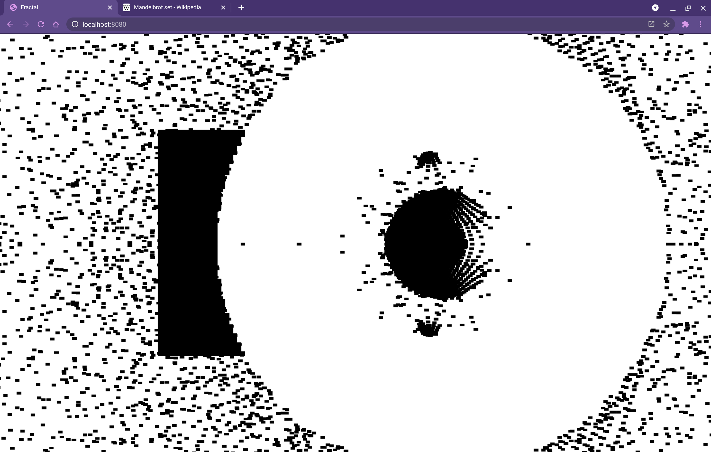
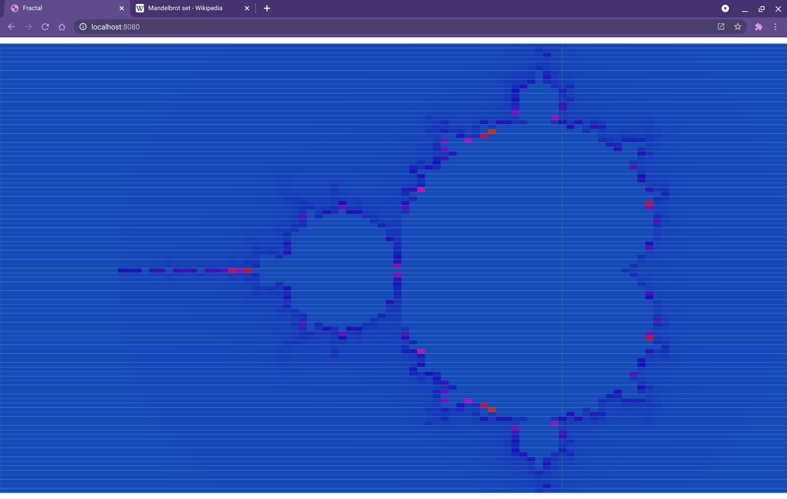
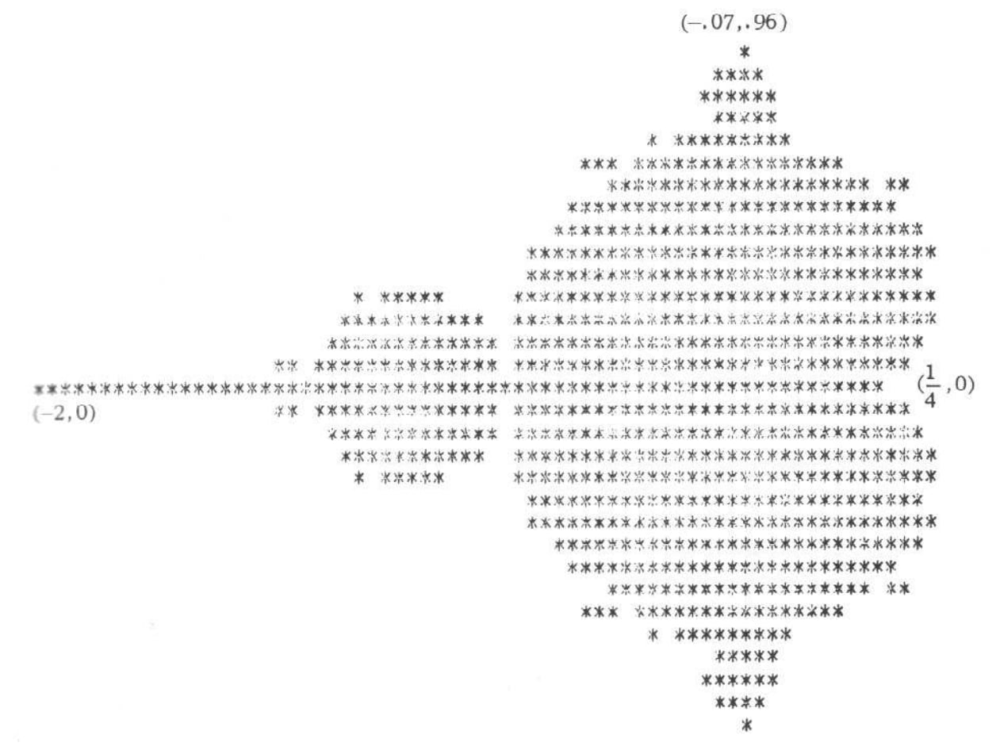
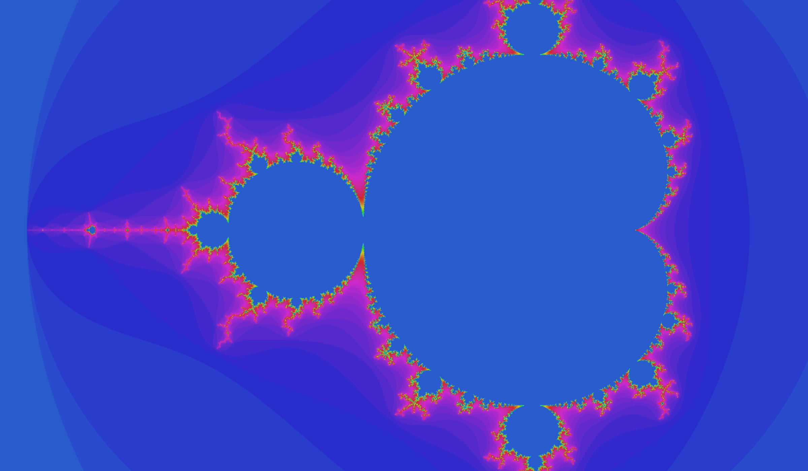
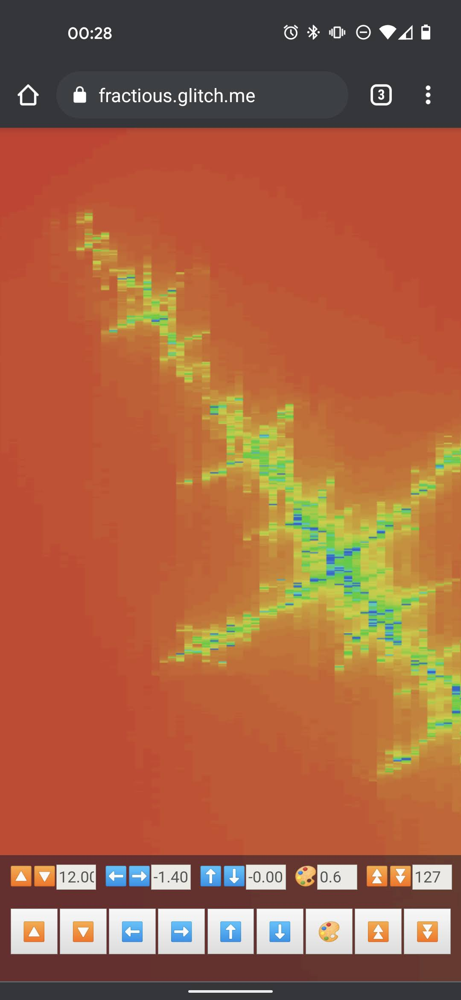
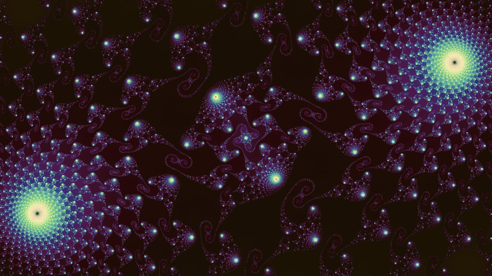

I built the first iteration of [Fractious](/posts/fractious/) back in 2021 as a way to start learning about WebGL and shaders. Rendering the Mandelbrot set is, of course, a classic rite of passage and approximately 86.3% of developers<sup>[citation needed]</sup> have built their own version in one way or another.

My first exploration was just in Canvas following the [algorithm from Wikipedia](https://en.wikipedia.org/wiki/Mandelbrot_set) and I ended up with this:



Now, in my defence this was back in the day when you'd actually try to understand an algorithm rather than just asking a robot to write it for you. I'm not entirely sure what was happening here, but I was encouraged nonetheless because there's clearly some relationship with the Mandelbrot set in the shape. A bit more studying and the next version was a huge leap forward:



For comparison, here's the earliest rendering of the set from 1978 in ["The Dynamics of 2-Generator Subgroups of PSL(2, C)"](https://abel.math.harvard.edu/archive/118r_spring_05/docs/brooksmatelski.pdf) by Robert Brooks and J. Peter Matelski:



Amazingly, there's a [2020 post from Matelski](https://math.stackexchange.com/a/3510304) on the Mathematics Stack Overflow, [2022 on the Fortran Discourse](https://fortran-lang.discourse.group/t/first-mandelbrot-set/2198/3), and a [comment on Stewart Russell's blog](https://scruss.com/blog/2020/07/07/the-mandelbrot-set-before-mandelbrot/comment-page-1/#comment-1279871) where you can see [FORTRAN 66](https://fortranwiki.org/fortran/show/FORTRAN+66) code that ran on a [UNIVAC](https://en.wikipedia.org/wiki/UNIVAC) mainframe to generate this print-out, _"I did not buffer the output—one computation one pixel."_ I couldn't find a reference for how long it took to render, but it's a 31 × 71 grid capped at 250 iterations per point meaning a maximum of 550,250 runs of $z_{n+1} = z_n^2 + C$, so... a while.

Anyway, next for me was moving away from the Canvas implementation on the main thread and getting into WebGL and shaders. Now we get to the real visuals even with a fairly naïve implementation.

```glsl
// Passed in from JS
uniform int maxiter;
uniform float zoom;
uniform float xpan;
uniform float ypan;

void main(void)
{
  // TODO actually scale to Mandelbrot coords
  float px = gl_FragCoord.x / zoom - xpan;
  float py = gl_FragCoord.y / zoom - ypan;
  float x = 0.0;
  float xtmp = 0.0;
  float y = 0.0;
  int iter = 0;

  for(int i = 0; i < 100; i++) {
    // Mandelbrot magic!
    xtmp = x * x - y * y + px;
    y = 2.0 * x * y + py;
    x = xtmp;
    iter++;

    // No while loops, so I guess this is how we exit
    if (x * x + y * y >= 2.0 * 2.0 || iter > maxiter) {
      break;
    }
  }

  float hue = mod(1.0/float(maxiter) * float(iter) + 0.5, 1.0);

  vec3 hsv = vec3(hue, 0.8, 0.8);
  // Magical HSV -> RGB conversion
  vec4 K = vec4(1.0, 2.0 / 3.0, 1.0 / 3.0, 3.0);
  vec3 p = abs(fract(hsv.xxx + K.xyz) * 6.0 - K.www);
  vec3 color = hsv.z * mix(K.xxx, clamp(p - K.xxx, 0.0, 1.0), hsv.y);

  // Jam that vec3 into a vec4
  gl_FragColor = vec4(color.x, color.y, color.z, 1.0);
}
```

Which gives us:


The Mandelbrot set rendering is really showing a map of the complex number plane where the x-axis represents real numbers and the y-axis is imaginary numbers (similar to OKRs or engineering estimates). The challenge comes when you zoom in on a section: to render something meaningful you need high precision in your floating points. Even asking for `precision highp float;` in the shader only gives a 32-bit float, or about 7 decimal points of accuracy. That meant that it was fairly quick in my exploring that I was hitting a pixelised mess as I zoomed in.



Pleasingly the solution for this comes back to FORTRAN again. The excellent ["Double Precision in OpenGL and WebGL"](http://blog.hvidtfeldts.net/index.php/2012/07/double-precision-in-opengl-and-webgl/)_(HTTP only so you may need to ignore a few warnings)_ from Mikael Hvidtfeldt Christensen describes implementing double precision support inside the shader. Conveniently someone had linked to a since-deleted Gist where I was able to steal the implementation. However, I didn't feel too bad about that because that implementation was already based on these [high-precision FORTRAN libraries](https://www.davidhbailey.com/dhbsoftware/) from David H. Bailey. I also used a colouring method with some added noise from the inimitable [Inigo Quilez](https://iquilezles.org/) of Shadertoy fame.

This is the version of [Fractious that's still hosted](/made/fractious/) on this site. And I'm still very proud of it - especially the iterative rendering which renders a slice of the canvas at a time to fit inside an animation frame without locking up the browser. However, it continued to irk me that the zoom limit was there. I stayed irked for about five years or so. In passing I had looked at the "Perturbation (🤨) theory" section on the [Wikipedia Plotting algorithms for the Mandelbrot set](https://en.wikipedia.org/wiki/Plotting_algorithms_for_the_Mandelbrot_set) article, but when it comes to complex mathematics there's really just this half-hour window around two in the morning when I can hold it in my head for long enough to write the code. I still kinda got the idea though - you calculate one point with high precision and then you make relative calculations for everything around that.

Also, I could just use an arbitrary precision library and render using Wasm to whatever depth memory allows, **but** I want the speed that running in parallel on the GPU gives me. At this point, I had to ask the robot for help and with my absolutely necessary and very skilled guidance, we were able to create what is (if I might toot my own horn for a second) a pretty speedy deep zooming Mandelbrot fractal explorer. Given you (by which I mean my three readers) also follow me on social media, you'll have seen that I post an inordinate number of captures from the app for my own enjoyment. Honestly, I could go on a True Detective style rant on how delving into the infinite sacred geometry of a deep zoom is something incomprehensible to the human mind, so you have no choice but to believe you've glimpsed the face of god, but let's save that for some roadside dive bar later. So, how does it all work?

The initial deep calculation is in a Wasm module written in Rust using the [Dashu](https://github.com/cmpute/dashu) library for the high-precision calculation. One challenge with the perturbation method is that you pick a point, record the number of iterations until it escapes, and then use that as your upper bound for the rest of the render. This only works effectively if the point you pick **is** actually the point that requires the most iterations. I rapidly found out that just using a single centre point created a terrible experience, e.g. not enough detail gets rendered or worse just a black screen. So, instead the Wasm module is doing that calculation for a 5×5 grid to effectively sample the viewport. This works well enough, but does still sometimes require a little jiggling to get things right. Those 25 points can still be quite expensive to render, so the entire process is inside a worker.

The Wasm then returns the orbit, which is the whole sequence of calculated values for $z_{n+1} = z_n^2 + C$, the x coordinate, y coordinate, and the number of iterations. In the shader we're then creating our own 128-bit floats by effectively combining 4 32-bit floats. This also means the shader still has to re-implement the add and multiply operations just like the old version. I'm going to gloss over the actual perturbation theory calculation because I still don't really understand it. Don't judge me... like you never just copied something off StackOverflow and called it a day. It works.

Finally there's a teeny bit of post-processing in there, because just doing a straight render on more complex areas of the fractal results in single pixels of wildly varying colours which all looks a bit messy. So there's a slight bit of smoothing in there to blend those spikes out while trying not to lose too much detail.

And that's it! There's full touch controls, so you can pinch zoom and pan around or scroll with your mouse to your heart's content. Improvement wise, the first version tapped out around a 10<sup>12</sup> zoom factor. The new version hits 10<sup>35</sup>. For reference, the sun is about 10<sup>11</sup> metres away. The entire observable universe is in the order of 10<sup>26</sup> metres... so, it's deep, man. It's deep.


