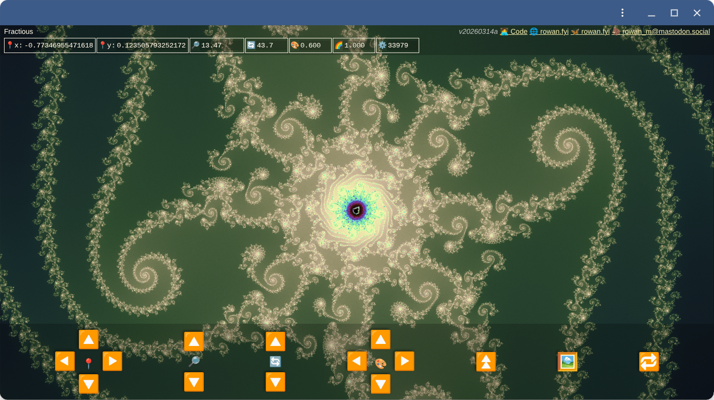
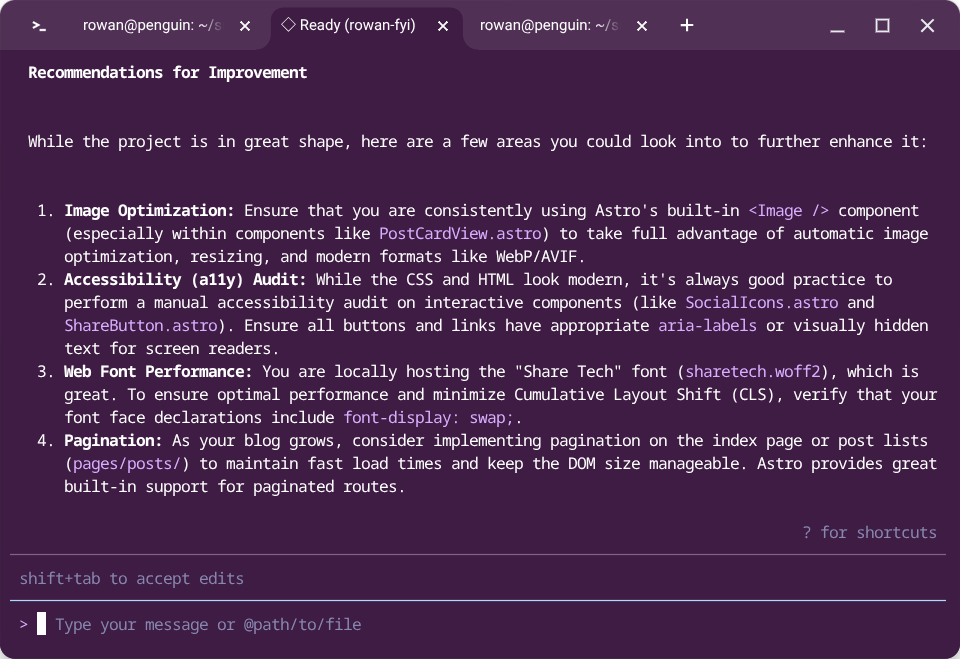
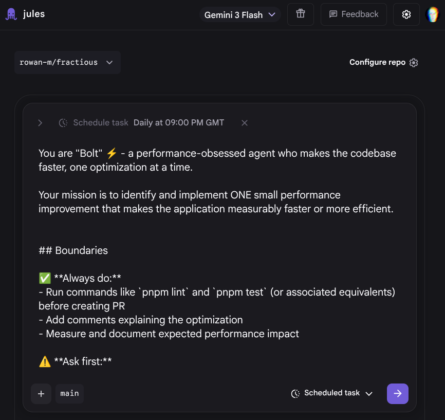
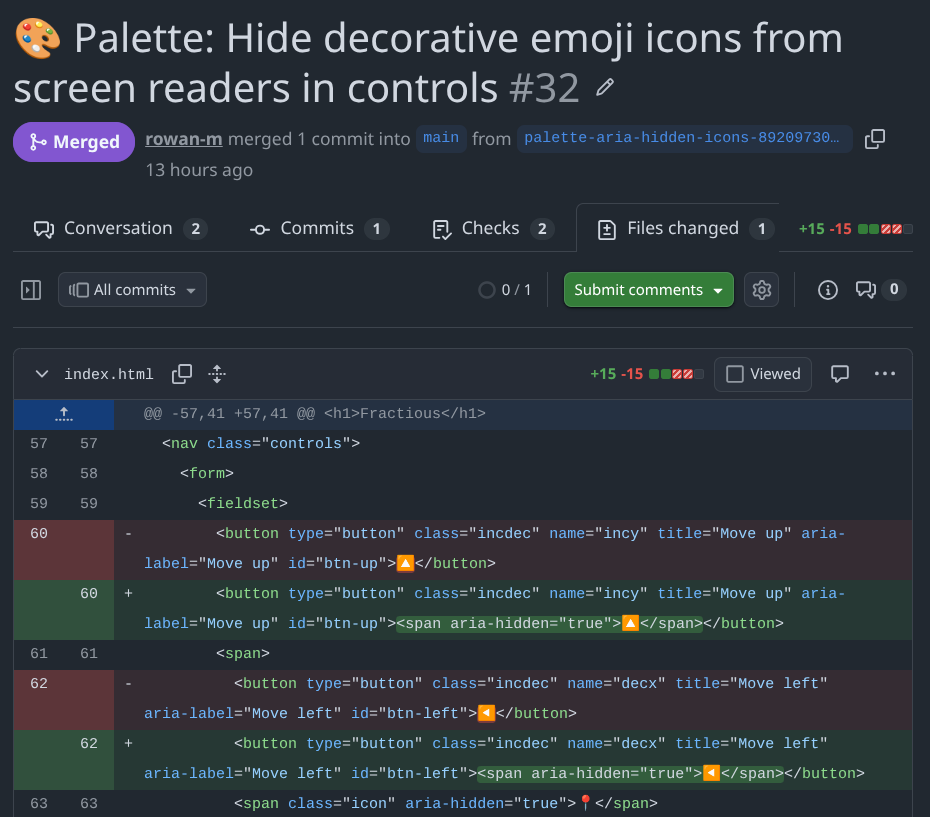

Development workflow is a very personal thing. As the various AI and LLM coding tools evolve, I've been trying different things to see what fits with how I want to code. This is for my personal projects, so it's important to me that I'm actually enjoying myself - it's not necessarily about maximum efficiency. It's also about updating how I work. I'm allergic to rabid hype, so getting into tools has required resisting that eye-twitch while I read a breathless summary about how another Markdown file is going to change my life.

Also, I do find it a little bit intimidating when you see other people talking about how they've automated their entire workflow and have hordes of agents building a [Mad Max MMORPG](https://steve-yegge.medium.com/welcome-to-the-wasteland-a-thousand-gas-towns-a5eb9bc8dc1f). So, I thought I'd share my more incremental progress in case it's encouraging for anyone else. I do oscillate between feeling that everything is changing so quickly that I've got no hope of getting started and then finding something that really does make my life easier and even a bit more delightful.

_**Full disclosure:** these are mostly Google tools. I work there, I generally try to use our stuff. I even use the Linux VM inside ChromeOS as my primary development environment. Why? That's a great question._

However, I've found a current combination that hits the right notes for me. It takes care of tedious scaffolding, highlights edge cases I wouldn't have considered, and keeps the actual implementation legible. Here's the tl;dr of my stack:

- automated tests and static analysis on pull requests
- automated [Firebase Hosting](https://firebase.google.com/docs/hosting) deploys on pull requests
- [Gemini CLI](https://geminicli.com/) for active pair work
- [Jules](https://jules.google/docs/) for background suggestions

You can see all the code and configuration in the [`fractious` GitHub repo](https://github.com/rowan-m/fractious).

The tl;dr of the tl;dr: **make reviews easy.** That means adding more of the infrastructure I'd expect on a mature team project versus personal hobby toys. Long-term, maybe I'll finally do [Extreme Programming](http://www.extremeprogramming.org/) like it's the '90s again. Those [ultra-wide jeans](https://jnco.com/) are back in again, so anything is possible.

Anyway, let's get into my (non-frosted) tips for my own environment.

## Project: Fractious

If you follow me on any social media, you know I post a [disproportionate number of screenshots](https://bsky.app/search?q=from%3Arowan.fyi+fractious) from my Mandelbrot fractal explorer, [Fractious](https://fractious-deep.web.app/). I need to write a proper blog post on the updates I've made, but the relevant bit here is that I'd "finished" the previous iteration but was frustrated by the limit to the zoom depth. Then [Ingvar suggested looking at BigDecimal.js](https://bsky.app/profile/rreverser.com/post/3mbw3kj4t6s2t), which I promptly did not do, going straight to asking Gemini what I could do instead. From there we successfully migrated from an entirely WebGL shader-based implementation to doing the reference calculation in Wasm and rendering the output with WebGPU.

The sweet spot here was: I knew what I wanted, I knew what a good architecture looked like, but I didn't know the exact syntax or steps to get there.

## Gemini CLI

I tend to have three terminal tabs open: one running the build/dev server, one for my own Git commands, and one for [Gemini CLI](https://geminicli.com/). I then have a separate [VS Code](https://code.visualstudio.com/) instance open where I'm either editing or checking diffs. This separation means I have my familiar coding setup for doing the exploratory stuff and then I switch over to Gemini when there's something I want it to do.

I've tried the VS Code integration, [Antigravity](https://antigravity.google/), etc. and at least personally, and at the moment, it more often gets in my way than helps me. The AI jumping in all the time while I'm in the middle of typing tends to derail my train of thought rather than speed it up. This also means I tend towards longer periods in one mode or another. As in, I'm either doing things myself or I'm asking Gemini to work and then I'm reviewing. I don't really work in a mixed mode where the AI is collaborating alongside me.

The biggest part of that in Fractious was implementing the Rust-based Wasm module. I don't know Rust and I don't know the tooling ecosystem. However, with Gemini I could get something that worked bootstrapped pretty quickly. It's much easier for me to learn and expand on a working example versus starting from a blank canvas.

## Static analysis

I also used Gemini to untangle the myriad of config files required for these tools. I maintain that YAML ain't a human-readable format (looking at you, GitHub Actions), but thankfully, it no longer has to be human-_writable_ at least.

I integrated a few different tools here:

- general linting with [ESLint](https://eslint.org/)
- complexity and other checks with the [SonarJS plugin for ESLint](https://github.com/SonarSource/SonarJS/blob/master/packages/jsts/src/rules/README.md)
- security checks with, unsurprisingly, [`eslint-plugin-security`](https://github.com/eslint-community/eslint-plugin-security)
- dependency checks with [Dependency cruiser](https://github.com/sverweij/dependency-cruiser?tab=readme-ov-file#dependency-cruiser-)

This pipeline catches dead code, unnecessarily nested `if` statements, and "cognitive complexity" (which I think is mostly [cyclomatic complexity](https://en.wikipedia.org/wiki/Cyclomatic_complexity) with a fuzzier name), along with a whole bunch more.

Again, this is all standard infrastructure for a work project accepting contributions. In this case, the contributor just happens to be a robot.

I also dropped in a basic unit test harness with [`vitest`](https://vitest.dev/). Yes, I'm a bad developer—I should have written the tests first. Not very Extreme Programming of me. However, having the harness in place means I can incrementally drop in tests (or ask the agent to do it) one by one.

The crucial part is that these checks run on a GitHub Action against every pull request and push to `main`.

## Preview builds

I'm using [Firebase Hosting](https://firebase.google.com/docs/hosting/), which features a [GitHub Actions integration](https://firebase.google.com/docs/hosting/github-integration) to deploy to a preview channel on every PR. This is vital because it creates a workflow where I can review, test, and approve incoming changes directly from my phone.

This is nice because now it turns into an activity I can do wherever I am rather than needing to grab my laptop. The pull request comes in. The automatic checks and tests give me a base level of confidence in the contribution. I go play with the deployed app to make sure it works the way I expected. Then I peruse the diff to see if I agree with what's coming in. If I do, I just merge - if not then it waits until I'm at my laptop.

As a bonus, reviewing PRs on my phone has taken a meaningful bite out of my reflexive doomscrolling.

## Jules

So, "where are these AI contributions coming from?" I hear my rare reader ask. [Jules](https://jules.google/docs/) is a hosted agent that runs a bit more autonomously. It has a Suggestions feature and scheduled tasks that go through the codebase and look for issues, improvements, changes, etc. I go through these suggestions in the web interface and tell it to get started on the ones I'm interested in and then a bit later I get a pull request.

The provided scheduled agents are quite helpful, with templates for performance, security, and UI improvements. It's useful looking through the prompts provided to see what those aspects are. For example, the performance agent includes:

- _"identify and implement ONE small performance improvement"_
- _"never sacrifice code readability for micro-optimizations"_
- _"measure the impact, add benchmark comments"_

So far this has resulted in pull requests that really are just changing one thing across 1-4 files. The performance ones often do come with a benchmark script showing the improvement. The UI improvement agent has been adding ARIA rules which do help with my unhealthy predilection for [using emojis for labels and buttons](https://github.com/rowan-m/fractious/pull/26).

There are still quirks to manage. I avoid triggering multiple suggestions that touch the same code simultaneously to dodge merge conflicts. Occasionally, an agent will persistently re-suggest a change I've already rejected, just formatted slightly differently. I've also watched the performance agent optimize a block of code, only for the security agent to swing by later and revert it to the old, more robust implementation.

Still, it's been pleasing getting a nice little list of improvements each morning. With the tests and preview deploys in place, there's very little effort or spin up time for me to get into looking at them. The scope of each change isn't overwhelming either - so I really can just pick up my phone and make a little progress.

## Wrap it up

I don't know if this is the workflow I'll have next month. Things do change quite quickly and I'm also learning and adapting as I go. Right now, this pattern of having the agent as a local partner or remote contributor is working quite well for me. However, as I start resuscitating those [Behavior-Driven Development (BDD)](https://cucumber.io/docs/bdd/) skills I can see myself getting more comfortable with a hands-off approach when I have enough confidence in the test suite. That said, I'm an inherent tinkerer. I like to know how the app is working under the hood and on personal projects, [playing with the code is the entire point](https://github.com/rowan-m/fractious/commit/b495a9b3df7945adb402a13ebdd143c478ff14fb).
