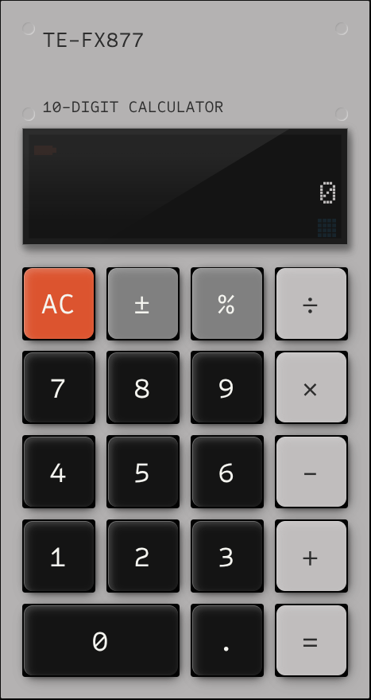
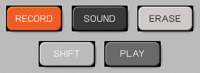

This started as a simple noise machine with classic white, pink, and brown noise. However, at the time the first of April was coming up so I decided to add some additional noises that fit with the modern world. As with any worthwhile April Fool's joke, I ended up putting in far more effort than was really justified. However, I'm pretty happy with the end result and wanted to share a few of the build details.

The whole aesthetic is a shameless homage to the gorgeous <a href="https://teenage.engineering/products/ep-133">Teenage Engineering K.O. II</a>. Now, I've never even seen one in real life but I wasn't about to let that stop me having some kind of virtual approximation. Given its iconic look, the first step was assuming that other people had already recreated it... and they had.

## Steal her look



Thomas created this [realistic skeumorphic CSS calculator](https://thomasmcinnis.com/posts/teenage-engineering-calculator/). I nabbed this as a base with the clean use of borders and box-shadows to get the button appearance.



Nicolas made this set of [EP-133 K.O.II buttons](https://codepen.io/nicolasjesenberger/pen/gOqzJed) where I like the actual use of a `<button>` element along with some subtle animations when the button is pressed. Bonus points here for using the actual Teenage Engineering font too!

I've combined elements from both for the noise machine. I also wasn't looking for subtle animations, so I've cranked those up to get a chunky, clunky button you can almost feel when you press the screen.

The volume slider is another story. I'll be honest, it probably has a whole bunch of issues in Safari and Firefox. Just look at all the footnotes for [vertically-oriented range sliders on Can I use...](https://caniuse.com/mdn-html_elements_input_type_range_vertical_orientation). I might get around to fixing it if people complain.

<marquee><h2>LCD marquee</h2></marquee>

The `<marquee>` tag is a classic in its beautiful mess of presentation and content lumped together. However, I still wanted that effect on the LCD display. I also wanted the appearance of the unlit pixels behind the text. Both of these came together reasonably neatly with the `ch` unit.

I'm using the [Doto font](https://fonts.google.com/specimen/Doto) for the 5×9 mono grid font. Then I spent slightly longer than I should have creating [a matching grid with SVG](https://modern-noise.web.app/img/lcd-text-background.svg). Then I can just set that up as a character-sized background:

```css
background-image: url("/img/lcd-text-background.svg");
  background-size: 1ch;
  background-origin: content-box;
  background-position: 0% 75%;
  background-repeat: repeat-x;
```

Then we animate the text from fully off the right side of the screen to fully off the left.

```css
.lcd-text>span {
  animation: marquee 10s steps(20, end) infinite;
}

@keyframes marquee {
  0% {
    transform: translateX(10ch);
  }
  100% {
    transform: translateX(-10ch);
  }
}
```

The trick here is instead of a smooth animation we're setting it to go in 20 `steps` and the range of motion is 20 `ch`. So each each step is a full character.

It's not perfect, because it leaves an awkward gap where no text is on screen. I'm unsure if there's a CSS-only way of doing this or if I'd need to adjust the values based on the length of the content in the tag. I'll leave that as a `TODO` for now.

## Bring the noise

Now on to the rabbit hole that is noise generation. Zach Denton wrote the informative [How to Generate Noise with the Web Audio API](https://noisehack.com/generate-noise-web-audio-api/) which gave me the code for white, pink, and brown noise. White noise is simple, literally just random values in a buffer. Pink noise is white noise passed through a -3dB per octave low-pass filter. Now, the Web Audio API has [`BiquadFilterNode`](https://developer.mozilla.org/docs/Web/API/BiquadFilterNode) with a `lowpass` type - however this is -12dB per octave. Now, there's the even more low-level [`IIRFilterNode`](https://developer.mozilla.org/docs/Web/API/IIRFilterNode) which states, _"All even-ordered IIR filters can be created using `BiquadFilterNode`. However, if you need to create an odd-ordered IIR filter, you'll need to use `IIRFilterNode`."_ I naively assumed that creating a -3dB per octave filter would be as simple as passing in a different parameter. After some time reading the [IIR Filter slides from the Signal and Image Analysis module](https://courses.grainger.illinois.edu/ece401/sp2017/lecture17iir.pdf) at the University of Illinois I realised that it was critical for me to identify the right poles and zeroes, but no matter how much I looked through those slides I have no idea what these terms really mean. It's possible that late-night coding doesn't always find me in the best frame of mind for learning new topics. Nonetheless, I feel relatively confident this is a Hard Problem. Hence the solution from Zach's blog:

```js
for (var i = 0; i < bufferSize; i++) {
    var white = Math.random() * 2 - 1;
    b0 = 0.99886 * b0 + white * 0.0555179;
    b1 = 0.99332 * b1 + white * 0.0750759;
    b2 = 0.96900 * b2 + white * 0.1538520;
    b3 = 0.86650 * b3 + white * 0.3104856;
    b4 = 0.55000 * b4 + white * 0.5329522;
    b5 = -0.7616 * b5 - white * 0.0168980;
    output[i] = b0 + b1 + b2 + b3 + b4 + b5 + b6 + white * 0.5362;
    output[i] *= 0.11; // (roughly) compensate for gain
    b6 = white * 0.115926;
}
```

To understand what these magic constants are, I highly recommend reading [DSP generation of Pink (1/f) Noise](https://www.firstpr.com.au/dsp/pink-noise/). This is one of those sadly decaying corners of the web where you find that many of the links are pointing to long dead servers. Specifically, this code was posted by Paul Kellet in October, 1999 and still stands, 26 years later, as the best approximate of a -3dB per octave filter. Copying and pasting code you don't fully understand is an honourable and long-standing tradition.

## Real-world experience

Finally, we get to the actual joke part of the entire project, some 14 paragraphs through this post. Initially I was thinking I would make something genuinely relaxing, like intermittent bird sounds or wind chimes. However with the state of the world being what it is, it seems better to try and innoculate yourself against things with controlled exposure. The excellent [freesound.org](https://freesound.org) has a huge catalogue of conveniently tagged clips. I grabbed a selection and converted them all to fairly compressed AAC files as I'm aiming for lightweight here, not gold-plated audiophile quality - I want this to load as fast as possible. Then I just play random sounds at random intervals to create the effect. So, thank you and credit to the various users below.

### Screams

A series of endless overlapping screams. Feel free to release your own tension and join in.

- [akridiy](https://freesound.org/people/akridiy/sounds/759454/)
- [AlSarcoli007](https://freesound.org/people/AlSarcoli007/sounds/220365/)
- [AlSarcoli007](https://freesound.org/people/AlSarcoli007/sounds/220369/)
- [BlueFairy311](https://freesound.org/people/BlueFairy311/sounds/457573/)
- [demensdeum](https://freesound.org/people/demensdeum/sounds/758591/)
- [FreqMan](https://freesound.org/people/FreqMan/sounds/42847/)
- [jorickhoofd](https://freesound.org/people/jorickhoofd/sounds/179320/)
- [Klangkobold](https://freesound.org/people/Klangkobold/sounds/547961/)
- [Lithe-Fider](https://freesound.org/people/Lithe-Fider/sounds/9703/)
- [marionagm90](https://freesound.org/people/marionagm90/sounds/220655/)
- [owly-bee](https://freesound.org/people/owly-bee/sounds/415352/)
- [queen_westeros](https://freesound.org/people/queen_westeros/sounds/222586/)
- [Reitanna](https://freesound.org/people/Reitanna/sounds/253771/)
- [roryshea](https://freesound.org/people/roryshea/sounds/747831/)
- [sironboy](https://freesound.org/people/sironboy/sounds/132106/)
- [SweetNeo85](https://freesound.org/people/SweetNeo85/sounds/13797/)
- [tcrocker68](https://freesound.org/people/tcrocker68/sounds/235592/)
- [TheSubber13](https://freesound.org/people/TheSubber13/sounds/239900/)
- [tomattka](https://freesound.org/people/tomattka/sounds/400183/)
- [tonsil5](https://freesound.org/people/tonsil5/sounds/416541/)
- [Valerie-Vivegnis](https://freesound.org/people/Valerie-Vivegnis/sounds/767890/)
- [Vitouliss](https://freesound.org/people/Vitouliss/sounds/173088/)

### Traffic

Get the true experience of returning to the office by sitting in traffic for as long as it takes.

- [99021905683](https://freesound.org/people/99021905683/sounds/571348/)
- [akahukas](https://freesound.org/people/akahukas/sounds/708707/)
- [AudioPapkin](https://freesound.org/people/AudioPapkin/sounds/716552/)
- [Debsound](https://freesound.org/people/Debsound/sounds/176003/)
- [deleted_user_2104797](https://freesound.org/people/deleted_user_2104797/sounds/164625/)
- [deleted_user_2104797](https://freesound.org/people/deleted_user_2104797/sounds/164627/)
- [DeVern](https://freesound.org/people/DeVern/sounds/349922/)
- [etcd_09](https://freesound.org/people/etcd_09/sounds/435497/)
- [G_M_D_THREE](https://freesound.org/people/G_M_D_THREE/sounds/513527/)
- [hyderpotter](https://freesound.org/people/hyderpotter/sounds/268809/)
- [iainmccurdy](https://freesound.org/people/iainmccurdy/sounds/643125/)
- [jorgens_](https://freesound.org/people/jorgens_/sounds/770985/)
- [keweldog](https://freesound.org/people/keweldog/sounds/182474/)
- [LaurenPonder](https://freesound.org/people/LaurenPonder/sounds/635681/)
- [Robinhood76](https://freesound.org/people/Robinhood76/sounds/106785/)
- [tlabrant1](https://freesound.org/people/tlabrant1/sounds/658724/)
- [wanaki](https://freesound.org/people/wanaki/sounds/569613/)

### Construction

Yes, the sound of growth, a thriving economy, and all right outside your window all day!

- [cognito perceptu](https://freesound.org/people/cognito%20perceptu/sounds/121531/)
- [cognito perceptu](https://freesound.org/people/cognito%20perceptu/sounds/17012/)
- [costamonteiro](https://freesound.org/people/costamonteiro/sounds/69891/)
- [esperri](https://freesound.org/people/esperri/sounds/118972/)
- [fkurz](https://freesound.org/people/fkurz/sounds/169127/)
- [G.Lamont](https://freesound.org/people/G.Lamont/sounds/118042/)
- [Heigh-hoo](https://freesound.org/people/Heigh-hoo/sounds/22584/)
- [InspectorJ](https://freesound.org/people/InspectorJ/sounds/400991/)
- [jorickhoofd](https://freesound.org/people/jorickhoofd/sounds/160045/)
- [ldezem](https://freesound.org/people/ldezem/sounds/386239/)
- [ldezem](https://freesound.org/people/ldezem/sounds/386300/)
- [lextrack](https://freesound.org/people/lextrack/sounds/273722/)
- [moxobna](https://freesound.org/people/moxobna/sounds/40158/)
- [pablodavilla](https://freesound.org/people/pablodavilla/sounds/592111/)
- [Rock Savage](https://freesound.org/people/Rock%20Savage/sounds/59263/)
- [Sparrer](https://freesound.org/people/Sparrer/sounds/50506/)
- [WIM](https://freesound.org/people/WIM/sounds/17908/)

## TODO

No personal project is ever finished, so here is a selection of some of the updates I'd like to add:

- Subtle SVG noise to create a textured effect to the background and buttons.
- The LCD icons are definitely an MVP version, I want something that fits the aesthetic a bit better and has more interesting animation.
- Stereo or spatial effects on the audio. The generated noise should be more immersive and I'd like the screaming to sound as if it's coming from every direction.
- More use of the Media Session controls - probably adding a next track button that lets you change the noise type.
- Smoother start, stop, and switch of noises. The fade in on start is reasonable, but ending is far too abrupt.

There's plenty more to do, so if you've got requests then ping me on your preferred social network in the footer to let me know!