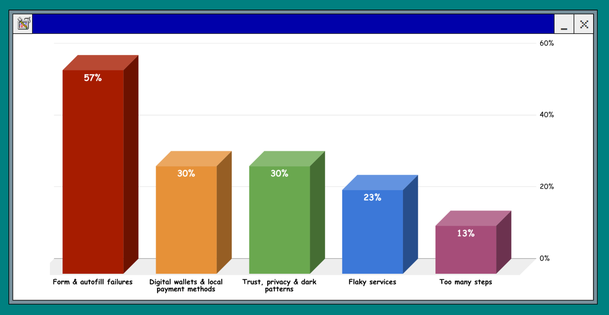

I polled you, my social media peers, on what irked and irritated you when it came to paying for things on the web. There is, of course, a large caveat associated with this: it's by no means "research" and very much represents people I know who are willing to talk to me, and goodness knows that's a small segment of the overall population. Still, I think some interesting trends and patterns came out nonetheless!

The original posts are still up, so feel free to keep adding to my dataset here or in reply to this article:

- [🦋 Bluesky](https://bsky.app/profile/rowan.fyi/post/3mmqwojnxps22)
- [🦣 Mastodon](https://mastodon.social/@rowan_m/116640742340950964)
- [🧵 Threads](https://www.threads.com/@rowan_m/post/DYzQohOiPFB)
- [👔 LinkedIn](https://www.linkedin.com/posts/rowanmerewood_payments-web-share-7465007535457103872-TkAj/)
- [🐦 Twitter](https://youtu.be/dQw4w9WgXcQ)

## Breakdown

I grouped the responses into the following categories. Since form and autofill failures were right at the top, just like we're browsing in 1999, I thought I'd graph it appropriately.

### Form & autofill failures

_Mentioned in **57%** of responses!_

Broken autofill implementations, strict validation errors, and demanding unnecessary details (like Zip+4) interrupt the flow. Forms designed with poor contrast, missing labels, or indistinguishable placeholders make it visually difficult to complete purchases.

### Digital wallets & local payment methods

_Mentioned in **30%** of responses._

Users expect seamless digital wallet integration (Apple Pay, Google Pay) and local methods (iDEAL). Forcing manual card entry causes frustration.

### Trust, privacy & dark patterns

_Mentioned in **30%** of responses._

Hidden shipping costs, artificial countdown timers, and aggressive data collection erode trust.

### Too many steps

_Mentioned in **13%** of responses._

Checkouts with too many pages, mandatory account creation, and repetitive data entry test user patience.

### Flaky services

_Mentioned in **23%** of responses._

Silent payment failures, ambiguous Pending statuses, and flaky MFA SMS delivery leave users confused.

## Personal perspective

A few things I've been thinking about after reading through everything:

- I think my own circle skews more privacy and security conscious, but at the same time people are happy, if not not insistent, that the browser / OS saves their payment and address details. It's clear people really see a value in having those details instantly entered, but I want to better understand the level of trust in the user-agent. This is some of the most sensitive information possible, but it's happily given and saved. Clearly the immediate value to you as user plays a part, but what are the assumptions about how that data is used and by whom?
- I want to understand if the high-level of autofill complaints is due to a high number of failures, or because the bar is generally high now so any friction is a real contrast. This is an area I need to explore with data a bit more.
- The "dark patterns" merit further investigation, as I don't think they're all actively manipulative but instead highlight a tension between and individual user need and a wider issue. For example, the checkout countdown with theatre tickets is because those seats are actively reserved while they're in your basket - you have to handle the abuse case where I just add as many seats as I can to my basket and leave them there. However, it's clear that the need for these patterns (when they're not sleazy) is not communicated.
- Mandatory account creation is something I want to understand better - likewise there I think there's a tension between what's needed to properly support a customer's purchase versus a feeling of privacy. When you make a purchase with a merchant they have to create some form of "account" with you, so is it really about the account or the friction of creating it?
- Finally, for flaky services this is another area where I want to see if I can dig into any data to look for patterns like tabs losing state or getting evicted when you swap to your SMS or banking app.

## Another breakdown

And let's slice things a bit more granularly just for good measure.

| Area                                    | Reason                         | Percentage |
| :-------------------------------------- | :----------------------------- | :--------- |
| Form & autofill failures                | manual entry                   | 20%        |
| Digital wallets & local payment methods | no digital wallet support      | 20%        |
| Form & autofill failures                | poor autofill integration      | 17%        |
| Form & autofill failures                | poor form implementation       | 17%        |
| Too many steps                          | too many steps                 | 13%        |
| Flaky services                          | multi-factor friction          | 10%        |
| Digital wallets & local payment methods | no local payment methods       | 10%        |
| Trust, privacy & dark patterns          | privacy & security             | 10%        |
| Flaky services                          | unclear payment status         | 10%        |
| Trust, privacy & dark patterns          | dark patterns                  | 7%         |
| Trust, privacy & dark patterns          | mandatory account creation     | 7%         |
| Trust, privacy & dark patterns          | surprise shipping costs        | 7%         |
| Form & autofill failures                | poor discount entry            | 3%         |
| Flaky services                          | poor in-app browser experience | 3%         |

## Raw responses

**The question**: 🫰🤬💰 What most annoys you about #payments on the #web? I want your opinion as a dev, customer, merchant, framework author - all of it. What causes you to get part way through a purchase and then just give up?

Finally, if you'd like to read everything that came back then here it is! Thank you to all of you who responded.

### [Ben Crichton](https://www.linkedin.com/feed/update/urn:li:activity:7465007536006492161/?dashCommentUrn=urn%3Ali%3Afsd_comment%3A%287466071790486999040%2Curn%3Ali%3Aactivity%3A7465007536006492161%29)

- **Reasons:** no digital wallet support, manual entry

- **Mentions:** Apple Pay, Google Pay, autofill

When a website doesn't have the option for either Apple/google Pay, or it doesn't autofill your card details.

The frontrunner for the number one \#firstworldproblem is having to manually fill out all your card details rather than the little drop down pop up, and it is normally for cheap websites / a sign of a cheap website.

_RM: Absolutely on board with this one. I've abandoned purchases because my card is just in the other room and there's no way I'm getting up from the sofa to go get it._

### [Arpan Garg](https://www.linkedin.com/feed/update/urn:li:activity:7465007536006492161/?dashCommentUrn=urn%3Ali%3Afsd_comment%3A%287465225585070542849%2Curn%3Ali%3Aactivity%3A7465007536006492161%29)

- **Reasons:** unclear payment status

Payments failing silently

_RM: Super annoying\! Does that mean it looks successful in the site, but never actual completes or some other effect?_

Basically payment gateway failure but no notification....

### [Dan Kirkland](https://www.linkedin.com/feed/update/urn:li:activity:7465007536006492161/?dashCommentUrn=urn%3Ali%3Afsd_comment%3A%287465100931093708800%2Curn%3Ali%3Aactivity%3A7465007536006492161%29)

- **Reasons:** too many steps, poor discount entry, no digital wallet support, privacy & security

- **Mentions:** PayPal, Google Pay

1\. too many steps.

2\. Not clear where to apply my discount code.

3\. No evidence that the site is trustworthy.

4\. Realising in time that it was an impulse buy.

5\. Asking silly questions.

6\. Seeing the site isn't GDPR compliant with auto opt-ins.

7\. Silly cookie experience.

8\. Not supporting paypal or Google Pay.

9\. Forgetting to finish what I

_RM: very valid. It's not like I'm buying a house \- once it's in my basket I want to click buy and go. Site reputation / trust is interesting, is there anything specific you look for there? TrustPilot, etc?_

if my vpn software hasn't warned me already, it's normally that I've clicked on something from my google feed and I'm not aware of that site. If I see something suspiscious on the site I'll abandon then but I'll also google for the site to see what comes up (including trustpilot).

### [Alice Tyson](https://www.linkedin.com/feed/update/urn:li:activity:7465007536006492161/?dashCommentUrn=urn%3Ali%3Afsd_comment%3A%287465083821177368576%2Curn%3Ali%3Aactivity%3A7465007536006492161%29)

- **Reasons:** poor in-app browser experience, no digital wallet support

- **Mentions:** Google Pay

When i am in the browser window that opens up as part of an ap (so if i clicked a link in facebook/linkedin/whatever) then my google pay doesn't kick in because its not my normal browser, its leaning on something else in the background.)

_RM: ooh, that's a good point. I've sometimes tapped on things in Instagram but not actually tried to make the purchase in there. I should test that._

### [Dan Dunford](https://www.linkedin.com/feed/update/urn:li:activity:7465007536006492161/?dashCommentUrn=urn%3Ali%3Afsd_comment%3A%287465016866357297154%2Curn%3Ali%3Aactivity%3A7465007536006492161%29)

- **Reasons:** too many steps

Usually the paying part for me.

_RM: though saying that... do you take things like, sign up for the mailing list for 10% off, or find a discount code, pick places based on loyalty points, etc. ?_

to be fair, I very rarely buy stuff from normal shop based sites. If I do, then yeah, if I can find a discount token, I'll go with the one with discount.

99% of the time It's usually Amazon or less so Ebay. One click buy, it's here in 24 hours.

### [Jonathan Defries](https://www.linkedin.com/feed/update/urn:li:activity:7465007536006492161/?dashCommentUrn=urn%3Ali%3Afsd_comment%3A%287465014228370780160%2Curn%3Ali%3Aactivity%3A7465007536006492161%29)

- **Reasons:** unclear payment status

Trying to pay off my credit card then going to the banking app only to return to the no longer existing credit card payment opportunity.

_RM: as in, the mobile browser drops the tab state or the app/site redirect doesn't work?_

It's been a long while since I did it. IIRC, it's a white screen, like an unsuccessful refresh.

### [Daniel Appelquist](https://www.threads.com/@actualtorgo/post/DY0SPAMiFFa?xmt=AQG0zLK_U3qY-veiDto6PpDcBX7oXdtcGymCYF6j505N-Q)

- **Reasons:** too many steps, no digital wallet support, mandatory account creation

- **Mentions:** Apple Pay

Something about inconsistent and confusing ux because of the multiplex of options between payment platforms, payment providers, browsers and device-based payment options. Money is hard, so some of this is inevitable.

_RM: Yeah... the holy grail of being about to support and offer everything, but also just showing me the one option I want right now._

_RM: Are there any sites you feel manage the flow well?_

I tend to really appreciate sites that can handle on-device payment (such as Apple Pay) without asking for additional info or requiring registration. So here's a concrete example that I have used \- palladiumboots.com. They provide a confusing array of payment options including highly promoting shop.app (which does require reg), but if you navigate it correctly then you can buy shoes with Apple Pay without registration. But they don't make it easy. So this is both a positive and negative example.

### [Rick Mangi](https://www.threads.com/@rmangi42/post/DY1wziuES3v?xmt=AQG0zLK_U3qY-veiDto6PpDcBX7oXdtcGymCYF6j505N-Q)

- **Reasons:** no digital wallet support, manual entry, poor autofill integration

- **Mentions:** Apple Pay, Shopify

So many options to make it smooth — Apple Pay, Shop, etc. I honestly get so annoyed when I have to fetch my physical credit card and type it in.

### [Dan Brickley](https://www.threads.com/@danbri/post/DY0OYTzjcA9?xmt=AQG0N0-IN78lsbiutbPNfvvI2VfpiqMG2GkBvfa6jYtwhQ)

- **Reasons:** poor autofill integration

- **Mentions:** autofill

Vague sense that form autofilling is s mess, and a wariness to accept any suggested values in case it changes the other fields at same time. No idea how much thus actually happens but it seems to have somehow traumatised me.

Also portability between my desktop and mobile browsing means using Chrome on iOS, which is a weird mix of Apple and Google stuff, and feels like nobody really cares about it.

_RM: Fully agree autofill still changes other fields I'd just manually filled with some default I didn't want. That's one I'll definitely dig into more._

Oof, still? I probably should have looked into this during the decade+ I worked for the company whose browser I still grumblingly use. Especially as I work on schema standards\! If you do dig, I’m curious what you find.

### [Tony](https://www.threads.com/@thegreatgonzo.uk/post/DY0FtjOkXWr?xmt=AQG03ldcs4aNkE4DQ9vz-qcMA85pwcRdp5t7BbjlrHekig)

- **Reasons:** too many steps, surprise shipping costs, poor autofill integration

1\) Too

Many

Steps

When there are 4 or 5 pages/next buttons when 1 or 2 would do (theatres and other arts organisations are terrible for this)

2\) Repetition. If I have registered an account and filled in my email, street address etc, please have the option to reuse this info in the payment process.

3\) Hiding the true cost, shipping can be very expensive these days, hit me with that as soon as you can, it is a key factor on if I am actually purchasing.

I think most of my other gripes for shopping online aren't really payment related.

_RM: Do you anyone in mind who does this well, or a particularly egregious offender? Feels like there are competing tensions at play \- like the old days when people would show the price without VAT because it made it look cheaper._

_RM: re: 2 \- how much of an irritation of that versus the browser's autocomplete?_

_RM: It's like they forgot ABC: Always Be Closing. I'm ready to buy, lets go._

### [Thomas Steiner](https://toot.cafe/@tomayac/116642893321082872)

- **Reasons:** poor autofill integration, poor form implementation

- **Mentions:** Verified by Visa, Paypal, autocomplete

Verified by Visa requiring a different device or just never triggering the in-app prompt. Fees for paying with, for example, PayPal. Autocomplete successfully filling my credit card info, but the site not "seeing" it. Expiry dates sometimes requiring a terribly slow date picker rather than just letting me type it.

_RM: I feel like you've been saving these up. 😁 The autocomplete one definitely hits me. We should be able to fix that._

The autocomplete one has, I think, to do with how Angular forms work, but I haven't exactly figured it out yet. I also couldn't name a concrete page off the top of my head where it happened, which, I reckon, isn't helpful, but I swear it occurs more frequently than you would think.

### [mushroom_man](https://infosec.exchange/@mushroom_man/116705849533111181)

- **Reasons:** manual entry, poor form implementation

- **Mentions:** Paypal

Not being able to paste in card details. I was adding my card to PayPal the other day and I had to type it in. Wtaf?

_RM: ahh, yes... sEcUriTy_

### [Modus](https://infosec.exchange/@ModusMundi/116700891194462993)

- **Reasons:** dark patterns

The shitty dark patterns that show up around buying something online like offers to buy extra shit after I have clicked checkout, or “helpfully” turning on whatever shitty insurance they are trying to sell me for my package to arrive safely.

_RM: I want to see just one example of someone using data to \*my\* benefit. Not "you just bought a kettle, would you like to buy... a kettle?"_

### [Poloniousmonk](https://autistics.life/@Uair/116700783948989221)

- **Reasons:** privacy & security

I've always kept my data as private as possible, so I only use a debit card. If you insist on zelle, I'm out. Crypto is just for crime, so no thanks. If I'm ordering something restricted and they demand a photograph, I'm out. I'm in America but VPN my machine into Europe to take advantage of their privacy laws. If your site chokes because of my security settings, I'm out. If it lies to me and says the problem is at my end rather than that the site is so malicious it simply won't load for a European, I'm out with prejudice.

_RM: I'm really interested in that spectrum of data: the bare minimum to complete a transaction, what's required for legal records, what's beneficial for customer service, and what's just sleazy dark pattern nonsense for marketing._

I've been trying to figure out why I use a computer so differently from damn near anyone, especially as I'm not a coder or anything. I mean--I've been terminally online since the 90s and if you uplook my fairly obscure real name, you'll get nothing. Nada. Zip. Bupkis. My guess is it's because I predate the GUI and the hard drive. I used computers when they were like old testament gods--lots of rules and no mercy.

The flip side of that world is that the software back then was masterable. Everything I used, be it a game or Appleworks, I knew everything it could do and how to make use of that, and could discover my own workarounds when something was buggy. I think starting in that place before going onto modern software, which operates under the hood like some kind of magic, left me aware of the underlying logic and capabilities of a two state thinking machine, and that's what nobody else seems to have these days despite being able to cajole the things into doing far more than I can any more.

I've never not known the content of the below-posted rant and never trusted a computer unless I knew it all the way through, which has been impossible for decades. Basically, you don't want to judge by me because I use the machine radically differently than damn near anybody any more. I offload zero cognitive function onto these things. I'd never let another human do my thinking for me, no way am I letting a machine do so. I've been at war with interface design for a long, long time. I create my own 'sound', 'video', and 'words' folders and manage my own media, and I never give anyone more than the absolute bare minimum data to use their service. I'm also willing to do without most everything on the net. I carry a flip phone and type every letter of my texts on a number pad rather than use predictive. I even resent the dishonesty of adding a hidden search engine in the address bar. Do not tailor your interface to my standards\! Nobody but me cares about this shit :)

https://rootcat.de/blog/do\_not\_work\_hacker24/

### [Royce Williams](https://infosec.exchange/@tychotithonus/116700765728397474)

- **Reasons:** multi-factor friction

- **Mentions:** SMS

MFA that assumes that my cell number will always be able to receive SMS.

_RM: ah yes, and if it does come through, then when, and will the checkout freak out when I swap away to get the code..._

### [Dave Rupert](https://bsky.app/profile/davatron5000.bsky.social/post/3mmrig63bzk27)

- **Reasons:** mandatory account creation, privacy & security

Creating accounts for every online transaction and getting unsubscribe-able emails from that company every day for the rest of my life.

_RM: Whoa, whoa, whoa... you're telling me your not creating a valued and authentic brand relationship? Is it the process of having to create an account during the flow or just having one made at all, as in you'd prefer a guest checkout?_

Creating accounts for every ecommerce platform is tedious to manage but the crux of my issue is that each transaction comes with risk where I give my name, phone number, address, CC number, and email address to someone who might be chill or to a behavioral data internet stalker.

_RM: Yeah, valid concerns on the security and privacy risks. I should dig into what Mullvad does for that balance of necessary data vs customer experience._

### [Sam Rose](https://bsky.app/profile/samwho.dev/post/3mmqwqtny3k23)

- **Reasons:** no digital wallet support

- **Mentions:** Apple Pay

If I can’t use Apple Pay my likelihood to complete the process is dramatically reduced.

_RM: How much of the checkout flow does that cut out for you? Or do you have an aspect of what it saves you that you really appreciate?_

In the best cases it’s the whole flow. The retailer gets payment and my address from it. I have to enter in basically no information. Sometimes it’s just the payment, though, and I have to give my address.

### [Sérgio Gomes](https://bsky.app/profile/sgomes.com/post/3mmqx2emubc2t)

- **Reasons:** poor form implementation

As a user: validation errors. It's not great having a site tell you your address (or worse, your name) is invalid, and then making you guess which perfectly valid characters they dislike.

You'd figure a few simple text strings would be able to travel unharmed from my keyboard to the shipping label.

_RM: Ah, when someone does reverse Postel's Law and filters to just \[A-Za-z\]+ I hit that when I'm trying to get things sent to the office and the name field won't accept digits or dashes. Do you remember any times you've seen it done really well?_

I think "done really well" is just taking your string and handling it correctly 🙂 Maybe have some safe-ish server-side mapping?

But if they must make me rewrite things myself, then I would like them to point out exactly where the issue is — which I don't remember ever seeing done right.

### [Remco Haszing](https://bsky.app/profile/remcohaszing.nl/post/3mn2wghg3p22e)

- **Reasons:** no local payment methods

- **Mentions:** iDEAL, Paypal, Google Pay

Many Dutch people don’t have nor want a credit card / PayPal / Google Pay. If there’s no option to pay with iDEAL, they just give up.

_RM: Integration with your customer's preferred payment method definitely makes sense. Is it mostly international sites you see doing this or is there some hurdle for local sites to implement too?_

It’s only international sites. Dutch sites can’t get away with this. For Dutch sites iDEAL is a must have, other payment options are optional.

### [Andrew Allen](https://bsky.app/profile/often.codes/post/3mmrqjgang22x)

- **Reasons:** no local payment methods

when it’s in dollars rather than gbp\! especially ex vat, so I have to math out what I’ll actually pay

_RM: Oh, man... it's like sites displaying language based on county location when you've explicitly set a language in the browser. Do you mean you've hit a site that ships locally in the UK but is somehow treating US as the default?_

mostly us based online courses, to be fair some are actual dollars and bank does the conversion, sometimes the merchant does the conversion. I don’t think there’s anything wrong with how they’re shown…just forever annoying

### [Patrick McDougle](https://bsky.app/profile/pmcdougl.bsky.social/post/3mmtx3o4bpc2g)

- **Reasons:** poor autofill integration, manual entry

A vaulted CC that doesn't work and you have to retype it. And it still doesn't vault right the next time.

_RM: Ah, yeah, I've got that before. Actually worse because you were expecting the smooth experience. Do you feel like that's a browser issue or a site issue when you hit it?_

Not sure. Might be related to autocomplete of the card info too. Esp if the tokenization happens on the front end.

### [Fuqiao Xue](https://bsky.app/profile/fuqiao.bsky.social/post/3mmsmftztak2o)

- **Reasons:** unclear payment status, multi-factor friction

- **Mentions:** UnionPay, WebNFC

As a user, the issue I occasionally encounter is when a payment has successfully gone through, yet the merchant's page still displays a "Pending Payment" status. Upon refreshing the page, I am then met with a prompt warning me not to make a duplicate payment.

Additionally, based on recent communications with UnionPay, I have learned that their requirements regarding fraud prevention for web-based payments cannot currently be met.

Specifically, they need to use the device's NFC capability to read data from an external physical bank card. For medium-to-high-risk transactions, they mandate the user's physical card for supplementary verification. However, the current WebNFC spec/impl does not appear to support this.

_RM: That payment confirmation step is absolutely a common theme\! Maybe there's a route with Secure Payment Confirmation there..._

### [Ana Tudor](https://bsky.app/profile/anatudor.bsky.social/post/3mmrmcl4ssc25)

- **Reasons:** poor form implementation

Forms that look like 👇

Sign in form where the inputs' background is the same as the surrounding background, there is no border and the placeholder text is barely visible against this background.

Now this was buying a VIP package that included early entry and I'm either front row or no show, so I didn't give up, but it was annoying.

In general, it's just stressful to buy stuff online, to know things can go wrong without me being able to fix asap, so I try to avoid it.

_RM: Wow, I had to tap on the image before I even saw there were fields there... I thought it was just an interstitial from a designer who really loved their whitespace._

And after getting past that, I had to fill in this. The inputs had no labels and the placeholders were almost indistinguishable from the input backgrounds.

_RM: This is amazing. It must be a deliberate choice as I cannot fathom how someone could accidentally make a form this bad._

"subtle" gone wrong ¯\\\_(ツ)\_/¯

In all fairness, they did radically fix it after getting complaints (it wasn't just me). They made it all consistent, added permanent good contrast labels, clear input outlines.

And it even looks better aesthetically now. But I had to use DevTools for it in 2024\.

### [Mary Branscombe](https://bsky.app/profile/marypcbuk.bsky.social/post/3mmrjcxgb422z)

- **Reasons:** surprise shipping costs

- **Mentions:** Shopify

Not being able to see shipping costs until I put something in the basket

guesstimate from my postcode or my damn IP I know you're tracking it

_RM: Oh, that's a nice one. Does anywhere stand out as having done the up-front cost well \- or anyone a particularly blatant repeat offender?_

Amazon (grrr) has the former, and Etsy. There’s one common e-commerce platform (I think want to say Shop?) that a ton of people use that puts it at the very last stage and NOPE

### [Dasblitz](https://bsky.app/profile/dasblitz.bsky.social/post/3mmrirrlhvk2k)

- **Reasons:** no local payment methods

- **Mentions:** iDEAL

When the only payment method is a credit card. (Which is still not super common to have in the Netherlands).

_RM: Oh, yeah \- I remember it's iDEAL over there. Are the main culprits for this international sites or do local companies do it too? If so, I wonder what the reason is... harder to implement?_

International sites, for instance there are many online courses that only accept credit card. I don't think I've ever seen a local company not implement iDeal. Good news is banks start to switch to creditcards as default in NL too. But will probably take a few years, before everyone has one.

### [Rick Ogden](https://bsky.app/profile/rickogden.com/post/3mnf4embmik2y)

- **Reasons:** manual entry

- **Mentions:** Apple Pay

Using Apple Pay but still having to enter all your details manually.

_RM: Where do you normally see that in the process? Details first, then Pay (I'm assuming) or Pay, then details (feels less likely)?_

Yes the former. Address, contact details, etc. can all be received from the Apple Pay API.

### [Squiddy](https://bsky.app/profile/dr-squiddy.bsky.social/post/3mmugr23gys2c)

- **Reasons:** dark patterns

A countdown timer that tells you how long you have to complete the transaction \- which exists for entirely arbitrary reasons.

Or when you want to buy tickets to multiple shows at a film/comedy/theatre festival and you have to complete an individual transaction for each one.

_RM: Reminds of the Crisis Inducer from Hitchiker's Guide to the Galaxy. "Quick \- they're after us\!" Got to get that purchase in before... well, doesn't matter. Before something._

### [Richard Clark](https://bsky.app/profile/phirate.bsky.social/post/3mmrwu5ljkc2b)

- **Reasons:** multi-factor friction

- **Mentions:** SMS

Link never sends the txt it says it sends so I have to autofill my credit card number again.

_RM: Oh my goodness, yes. Flaky two-factor that turns a process that should be seconds into a drawn out investigation. Awful. Especially when you've got a WiFi connection but not reception._

Yeah. Honestly looking forward to when it's all agents handling this and I just get an approval notification sometimes. Will stuff I ordered sometimes end up in Wellington, Cumbria? yes, but that might be a price I'm willing to pay for not having to deal with this stuff anymore :)

_RM: The agent angle is intriguing. Do you imagine telling it to buy a specific thing or just a vague goal? What would you want in terms of how you trusted it?_

There’s a lot here, but basically I go “we’ve run out of cat food again” and it does the rest and at some point I get a thing on my phone “Pay $50 to Pets Co?” , and if it’s a common thing no approval needed

The trust piece is largely handled by budgets and approvals for new or unexpected things

It’s worth noting tho that the payments provider doesn’t need to implement these things. The agent can have a wrapper in its access just fine

### [T. Nguyen](https://bsky.app/profile/tnsicdr.bsky.social/post/3mmr3bju5hs2x)

- **Reasons:** poor form implementation, manual entry

Whenever I have to enter a Zip+4, I’m out of there

Your form has my street address and my broader postal code, do the lookup yourself

_RM: Oh, interesting\! Do you prefer the pattern where you start typing a ZIP / post code and it's showing you addresses? Or you want to put that in and it just one-shot fills the rest with the option to change it if needed?_

I’m fine typing it in, but there’s just a weird one every once in a while that wants a full 9 digit US Zip Code that is almost ever used in day to day.

It’s annoying to ask for since I have to then go to USPS to do the look up from my 5 digit code and street address…
