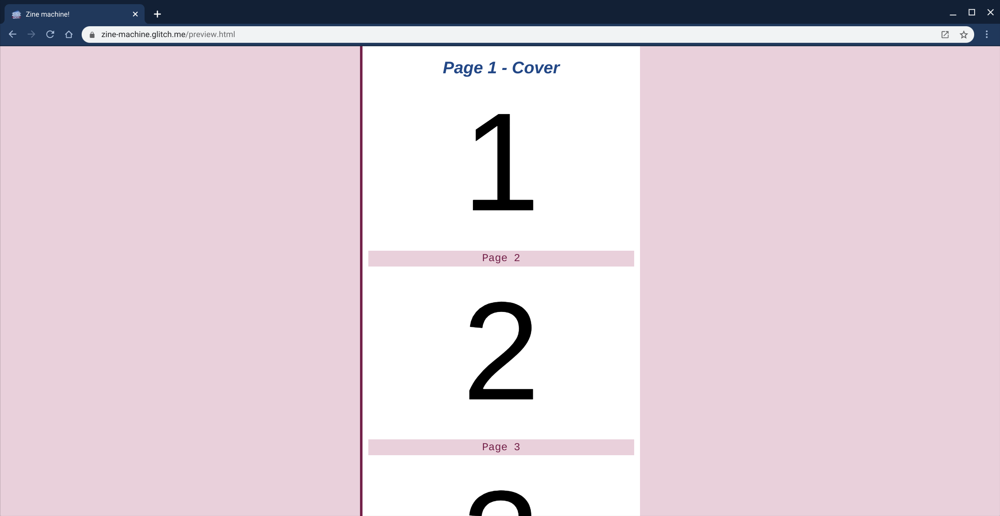
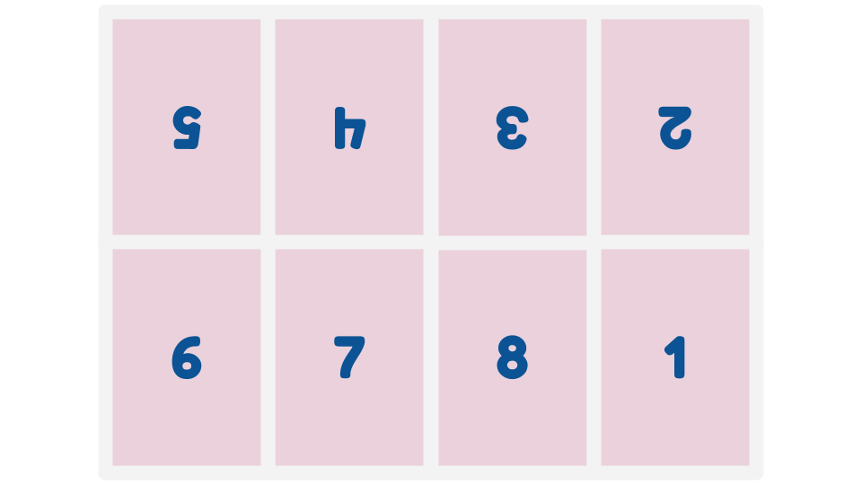
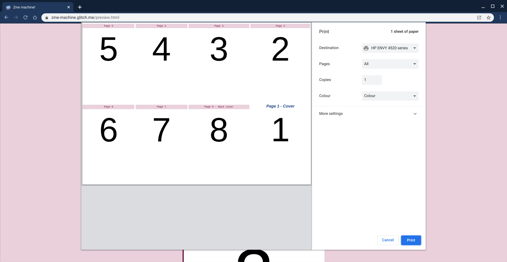

I loved the ingenuity of zine templates, that origami or map-like magic of a single piece of paper folding into an entire little book. That made me think, surely we should be able to do this on the web - right? A web page that you can read on a screen, but when you press print it turns into that magical little book. The answer is: of course we can! If you want the short version, then jump right in and read about how to make a CSS zine... in the form of a CSS zine!

Have a peek below ⤵️ or
on ➡️ [**`zine-machine.glitch.me`**](https://zine-machine.glitch.me)

<iframe src="https://zine-machine.glitch.me" class="glitch"></iframe>

We're going to need two key bits of functionality to make this happen:

 - [Print Stylesheets](http://bit.ly/rachel-on-print)
 - [CSS Grid](https://bit.ly/rachel-on-grids)

## 🏗️ HTML structure

Let's see how we build this up. Step one is a nice, simple, semantic layout for our HTML:

```html
<main class="zine">
  <header class="zine-page page-1"></header>
  <section class="zine-page page-2"></section>
  <section class="zine-page page-3"></section>
  <section class="zine-page page-4"></section>
  <section class="zine-page page-5"></section>
  <section class="zine-page page-6"></section>
  <section class="zine-page page-7"></section>
  <footer class="zine-page page-8"></footer>
</main>
```
You can style that for the screen however you want, the important bit is that we're going to wrap the styles that are just for screen display in a [media query](https://developer.mozilla.org/en-US/docs/Web/CSS/@media):

```css
@media screen {
  body {
    max-width: 30rem;
    background: #ead1dc;
    margin: auto;
  }

  .zine {
    background: white;
    padding: 10px;
    border-left: 4px solid #741b47;
    border-bottom: 4px solid #741b47;
  }
  
  .zine-page {
    margin-top: 10px;
  }
}
```

Nothing too exciting, but just so we can break up the text a little let's see what that looks like with a little text thrown in there:



## 🖨️ Print CSS

Now the fun part, we can then use the matching `@media print` query to enclose our print styles… but what are we going to put in there? First, let's see what we're trying to make. Here's the layout of the pages we need:



As you can see, this doesn't flow in any kind of top-to-bottom order that would match the order of the content in our HTML. We don't want to add any weird markup to make this possible, so we're going to use CSS grid to essentially pick up and reposition each individual page where we need it.

First, let's drop in a little CSS to hint how we'd like the page set up. We can use the [`@page` rule](https://developer.mozilla.org/en-US/docs/Web/CSS/@page) for this.

```css
@media print {
  @page {
    size: landscape;
    margin: 0;
    bleed: 0;
  }
}
```

To be honest, it's going to be a bit hit or miss as to whether or not the combination of your browser, OS, and printer actually pays any attention to that… but it's nice to say we tried.

## 🔲 CSS Grid

Next up, let's create our grid. We've got our `.zine` container which holds each `.zine-page`. 

```css
.zine {
  width: 100vw;
  height: 100vh;
  display: grid;
  grid-template-areas:
    "page-5 page-4 page-3 page-2"
    "page-6 page-7 page-8 page-1";
}
```

I ❤️ [`grid-template-areas`](https://developer.mozilla.org/en-US/docs/Web/CSS/grid-template-areas) because you're essentially just dropping in a diagram that matches your layout. In this case, we've laid out some named areas mapping to each of our pages in a 4 × 2 grid.

We need to map those grid areas up to our individual page elements though, so let's pop in that mapping:

```css
.page-1 {
  grid-area: page-1;

}

.page-2 {
  grid-area: page-2;

}
// you get the idea...
```

Now we're getting somewhere! Let's take a look at the print preview for the page and see what we get!



That's progress, but we need to flip a few of those pages upside down. That's easy enough with a CSS [`transform`](https://developer.mozilla.org/en-US/docs/Web/CSS/transform):

```css
.page-5, .page-4, .page-3, .page-2 {
  transform: rotate(180deg);
}
```


That's our layout done! Well, almost... when you print it out you need to fold along the edges of the page. You can do this just by folding in half, but let's pop some guidelines in just to make it clear. Now, we *could* go in an but the relevant individual `border` definitions on the edges of each `.zine-page` but frankly that's a lot of work and it's doubly confusing to remember that `border-top` will actually be at the bottom of the rotated pages. So, we're just going to use the simple trick of settings a background colour for our grid, and put gaps between our white pages so that the grid shows through. Simple!

```css
.zine {
  width: 100vw;
  height: 100vh;
  display: grid;
  grid-template-areas:
    "page-5 page-4 page-3 page-2"
    "page-6 page-7 page-8 page-1";

  gap: 1px;
  background: lightgrey;
}
```

I've made that gap a bit bigger for the screenshot, but there we go!

There's one slight tweak to the `transform` though:

```css
.page-5, .page-4, .page-3, .page-2 {
  transform: rotate(180deg) translateX(-0.25px);
}
```

For some reason, the pages don't seem to rotate around their *exact* centre, which means that when the border is visible is doesn't exactly line up either. If like me, that ever so slight but niggling obvious misalignment keeps you lying awake at night then that little bump over from the `translateX` will fix it.


That's it! There are plenty of cool things to still do with different content for the screen versus print version. For example, you could make sure that any [links in the document are added to the print output](https://css-tricks.com/snippets/css/print-url-after-links/) with:

```css
@media print {
  a::after{
    content: " (" attr(href) ") ";
  }
}
```

You might also want to swap out images that would be ink-heavy in the print version for simpler line-art.

## ♻️ Make and share your own!

I'd love to see you make your own 'zine, like this hand-drawn ["The Little Crash Course on Electronics"](https://crash-course-electronics.glitch.me/) from [Erika](https://bsky.app/profile/erikaheidi.bsky.social).

I'm sure there are some usability tweaks to add in the code too! So, go out there and [remix the project](https://glitch.com/edit/#!/zine-machine?path=template.html:1:0) to show me what you create!

