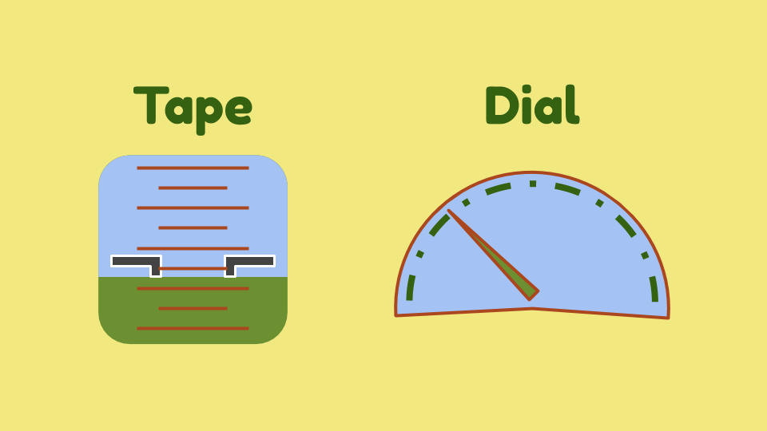
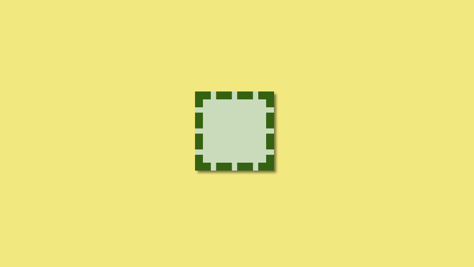
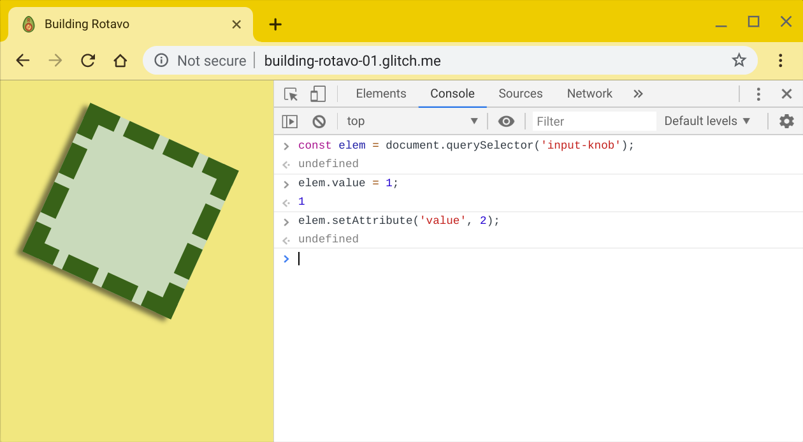
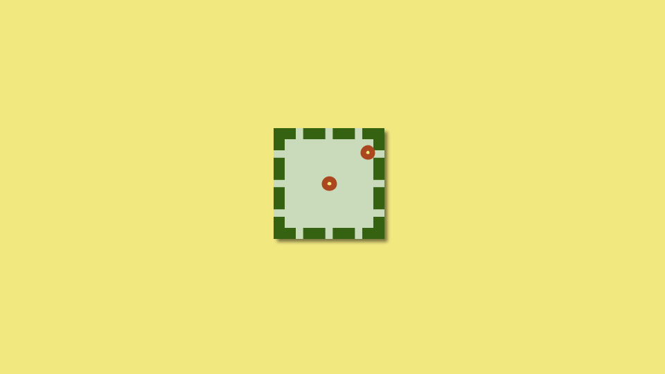
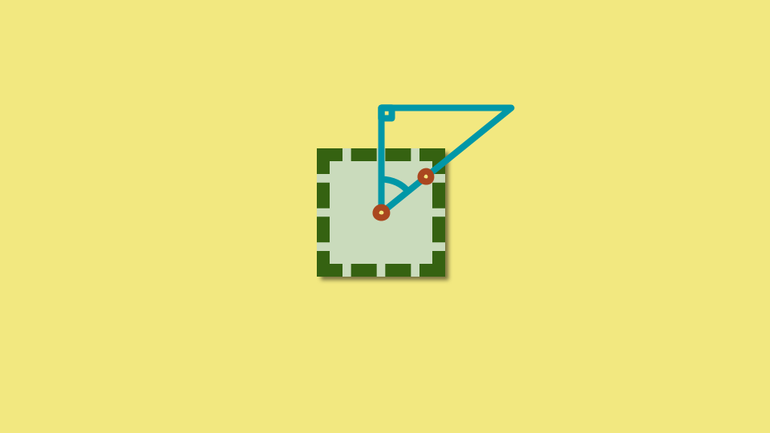
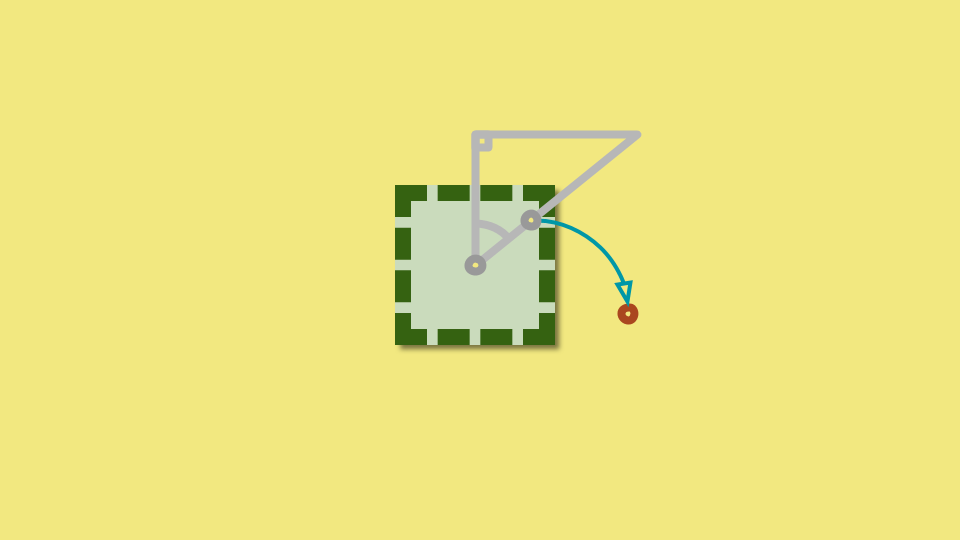
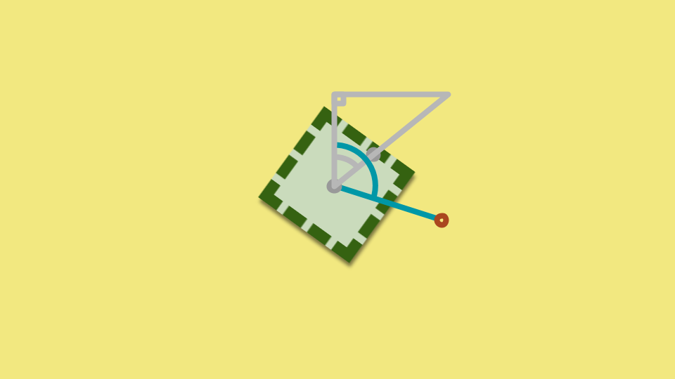
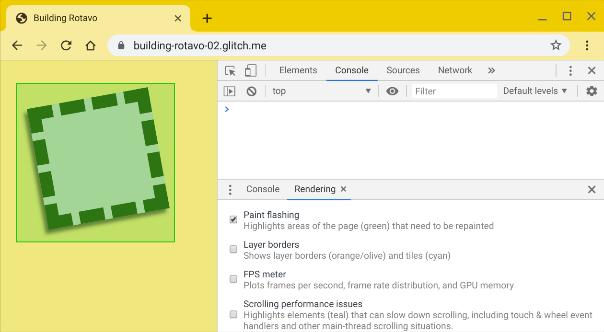

_This is the first in a series of posts detailing how I built the_ [🥑 _Rotavo PWA_](https://bit.ly/rotavo-pwa)_. Give it a whirl and see what you can draw!_

None of the cool kids are into skeuomorphism any more, but that doesn’t mean there’s no place for an analogue to physical controls in the software world. Let's see how we can recreate the (hopefully) intuitive experience adjusting the volume on your stereo 📻 by building our own rotating, touch-sensitive knob web component.

## Contents

  * [🎛️ Sliders, tapes, and dials](#sliders-tapes-and-dials)
  * [⚛️ A basic Custom Element](#a-basic-custom-element)
  * [👻 Enter the Shadow DOM](#enter-the-shadow-dom)
  * [🚧 Browser support](#browser-support)
  * [🤝 Handle touch](#handle-touch)
  * [👆 Pointer Events and default behaviour](#pointer-events-and-default-behaviour)
  * [📐 Touching trigonometry](#touching-trigonometry)
  * [🔄 A touching demo](#a-touching-demo)
  * [🚧 Oh wait… browser support](#oh-wait-browser-support)
  * [🖌️ Painting and performance](#painting-and-performance)
  * [🏆 Bonus content](#bonus-content)

## 🎛️ Sliders, tapes, and dials

We're going to use `input type="range"` as the basis of the API we want our component to present. The snippet below will create a little slider that will go from from 0 up to 100 with a starting value of 42.

```html
<input type="range" name="volume" min="0" max="100" value="42" />
```


A solid foundation, but is it the best solution? If like me, you enjoy the light reading that is the proceedings of the [Symposium on Human Interface 2009, Held as Part of HCI International 2009](https://books.google.co.uk/books?id=I47_sQnnf_IC&pg=PA773&lpg=PA773&dq="Pilots+find+it+harder+to+read+tape+displays+than+analog+dials"&source=bl&ots=7KsvlTp7ZJ&sig=ACfU3U3_Ho64oA7hoCkKl1jNUq_QSJcODw&hl=en&sa=X&ved=2ahUKEwi-k_i6n5PjAhXNasAKHfjiBd0Q6AEwAHoECAAQAQ#v=onepage&q="Pilots%20find%20it%20harder%20to%20read%20tape%20displays%20than%20analog%20dials"&f=false), then nestling in part 2 around page 773, you'll find this valuable nugget:

> Pilots find it harder to read tape displays than analog dials

We're going to need a little pilot lingo to make sense of the UX knowledge that's being dropped here.



A "tape" display shows information in a linear fashion, named because it was literally a tape that spools up and down behind the glass. This might be used to show something like altitude or air speed. An alternative is the dial indicator that displays that same linear information in a rounded layout, often used on a car dashboard for speed and fuel level. The hypothesis here is that a human can quicker interpret a rough value from the dial as opposed to the tape because the entire range is visible.

I'll be honest, this isn't overly relevant to building our component but I wanted your first impression to be that I was taking an evidence-based approach to my work. Plus, the more I think about it I'm not sure the benefit of seeing the whole scale in one go on a dial actually applies to a knob we can rotate multiple times… The truth is, I built this for fun and it's a happy accident that something of value came out of it. We shall park the Engineering vs. Art debate for now though and move on to creating this component.

## ⚛️ A basic Custom Element

I'm going to zip through the basics fairly quickly, so if you're looking for a proper introduction you should head over to "[Custom Elements v1: Reusable Web Components](https://developers.google.com/web/fundamentals/web-components/customelements)".

We're going to start simple: an element with a single `value` attribute. A Custom Element needs a "`-`" in the name to distinguish it from built-in elements, so let's go with `<input-knob>` to provide that link back to `<input type="range">`:

```html
<input-knob value="1"></input-knob>
```

For convenience, we're going to map the attribute on the HTML element to the JavaScript class as well so that we can do things like this:

```javascript
const knob = document.querySelector('input-knob');
knob.value = 2;
```

That means we need to extend the `HTMLElement` class, wire up the attributes, and then connect it to our page:

```javascript
class InputKnob extends HTMLElement {
  constructor() {
    // Nothing to do in here at the moment, but we do need to call the parent
    // constructor
    super();
  }

  // Watch for changes on the 'value' attribute
  static get observedAttributes() {
    return ['value'];
  }

  // Map the JavaScript property to the HTML attribute
  get value() {
    return this.hasAttribute('value') ? this.getAttribute('value') : 0;
  }

  set value(value) {
    this.setAttribute('value', value);
  }

  // Respond to any changes to the observed attributes
  attributeChangedCallback(attrName, oldVal, newVal) {
    // nothing yet
  }
}

// Map the class to an element name and make it available to the page!
window.customElements.define('input-knob', InputKnob);
```

Now, if you load that up in the browser you will see… nothing. Nothing on the page and nothing in the console. Nothing is displaying, but also - nothing is explicitly broken. We've successfully attached a new element in the page, but all we've created is an empty element. So, it's working in the same way that adding an empty `<span>` to a page "works". Conveniently though, our new `<input-knob>` element can be styled just like anything else on the page - let's make things a bit more obvious.

```css
input-knob {
  display: block;
  background: #cadbbc;
  border: 1rem dashed #356211;
  box-shadow: 0.3rem 0.3rem 0.3rem rgba(0, 0, 0, 0.5);
  width: 8rem;
  height: 8rem;
}
```



Et voilà, a visible square!

## 👻 Enter the Shadow DOM

With the element display, we should do something with the `value` attribute. Specifically, we want to rotate the element based on the attribute's value. The core of this is going to be a [CSS variable](https://developer.mozilla.org/en-US/docs/Web/CSS/Using_CSS_custom_properties) that we use in a `transform`, like this:

```css
{
  --angle: 0rad;
  transform: rotate(var(--angle));
}
```

However, we don't want to just set this style directly on the `<input-knob>` element as it's exposing an implementation detail to the user of our component. If a developer wants to add `<input-knob>` to their page and apply a rotation, it's going to clash. To address this, we're going to make use of the [Shadow DOM](https://developers.google.com/web/fundamentals/web-components/shadowdom) to create some markup that's essentially private to our component where we can add our own structure and style needed to enable the component's behaviour.

We're going to start with this HTML:

```html
<style>
  #container {
    --angle: 0rad;
    transform: rotate(var(--angle));
  }
</style>
<div id="container" part="container">
  <slot></slot>
</div>
```

Let's break down what's happening here:

- The `--angle` CSS variable will be updated to control the rotation of the element
- The `id="container"` in the `<div>` is defining the wrapper element we're going to rotate
- The `part="container"` in the `<div>` instructs that we want to make the element available for styling externally
- The `<slot>` element defines where `<input-knob>`content in the tag`</input-knob>` should be rendered

The reason we want to expose the `<div>` for styling via `part="container"` is because our now our "`<input-knob>`" element is not going to rotate. So, that can still be styled - but that will remain fixed when the value changes. Instead we need to make use of the [`::part()` selector](https://meowni.ca/posts/part-theme-explainer/) in our style sheet. In this case, it's a simple addition.

```css
input-knob::part(container) {
  display: block;
  background: #cadbbc;
  border: 1rem dashed #356211;
  box-shadow: 0.3rem 0.3rem 0.3rem rgba(0, 0, 0, 0.5);
  width: 8rem;
  height: 8rem;
}
```

Back to our element, now we know what structure we want it's time to drop that in a template our element can use. We'll define that just outside the `InputKnob` class:

```javascript
const template = document.createElement('template');
template.innerHTML = `
  <style>
    #container {
      --angle: 0rad;
      transform: rotate(var(--angle));
    }
  </style>
  <div id="container" part="container">
    <slot></slot>
  </div>`;
```

Next we want to add a shadow root to our element and clone that template into it:

```javascript
class InputKnob extends HTMLElement {
  constructor() {
    super();
    this.attachShadow({ mode: 'open' });
    this.shadowRoot.appendChild(template.content.cloneNode(true));
    this._container = this.shadowRoot.getElementById('container');
  } // ✂️ rest of the class omitted
}
```

We're grabbing a reference to our `#container` so that we can update that `--angle` variable.

```javascript
// class InputKnob
_drawState() {
  this._container.style.setProperty('--angle', `${this.value}rad`);
}
```

We want to update that value when the component is first added to the page and whenever the `value` is changed.

```javascript
// class InputKnob
connectedCallback() {
  this._drawState();
}

attributeChangedCallback(attrName, oldVal, newVal) {
  this._drawState();
}
```

With that, we've now got a component that rotates based on the `value` attribute. We can verify that by opening up the browser console to try setting those values and watching the square rotate.



Ok, ok - you're underwhelmed, I should give you something interactive. Let's bring it full circle and add a slider to control the rotation. It's as simple as:

```html
<input-knob value="2.5"></input-knob>
<input type="range" name="angle" min="0" max="6.28" step="0.1" value="1" />
<script>
  const knob = document.querySelector('input-knob');
  const slider = document.querySelector('input[type=range]');
  // Just take the value from the slider and set it straight on the knob
  slider.addEventListener('input', () => { knob.value = slider.value; });
</script>
```

Try it for yourself here below. The slider should take the square from 0 to just under 2π (6.28) radians or a full rotation.

<iframe src="https://building-rotavo-01.glitch.me" class="glitch"></iframe>

## 🚧 Browser support

That was a little too clean though, eh? Hardly what modern web development is all about. I may have neglected to mention that there's a bit more going on in the above example to get it display in different browsers. In fact, if you check [MDN's section on browser support for `::part()`](https://developer.mozilla.org/en-US/docs/Web/CSS/::part#Browser_compatibility) - hmm, well I should probably drop a pull request in for that. Basically, it's [Chrome and other browsers have made positive noises](https://chromestatus.com/features/5763933658939392) but we're not there yet.

First issue is addressing browsers that don't support Custom Elements or Shadow DOM as much as we need. Luckily, we can use the [`webcomponents.js` polyfill](https://github.com/webcomponents/polyfills/tree/master/packages/webcomponentsjs) which will detect what support is needed. Drop that script in before importing / defining the element. I'm grabbing it from `unpkg.com`, but you can also just download the bundle or use `npm` as per the instructions.

```html
<script src="https://unpkg.com/@webcomponents/webcomponentsjs"></script>
```

Don't get lulled into a false sense of security - it gets dirty now. I couldn't find a good way of detecting support for `::part()`, so bear with me. Remember we added the `part="container"` attribute to our element? We're going to test if that attribute is accessible via JavaScript. If it isn't, we need to create some alternate structure to style. In this case, a `<span>` to wrap any content in the element and a `.fallback` class.

```javascript
// connectedCallback()
if (!this._container.part) {
  // create a <span>
  const wrapper = document.createElement('span');
  // move this element's child nodes into it
  wrapper.append(...this.childNodes);
  // add the classes
  wrapper.classList.add('fallback');
  this.classList.add('fallback');
  // and add the wrapper into this element
  this.append(wrapper);
}
```

Now we duplicate the styling for the fallback elements:

```css
input-knob.fallback {
  display: block;
}

input-knob.fallback>span.fallback {
  display: block;
  background: #cadbbc;
  border: 1rem dashed #356211;
  box-shadow: 0.3rem 0.3rem 0.3rem rgba(0, 0, 0, 0.5);
  width: 8rem;
  height: 8rem;
}
```

Ideally, instead of duplicating the whole block we could add the selector to our existing rule - however, that causes at least one of the other browsers to ignore the whole thing. So, copy/paste it is. Gross. Anyway, now we have an element that works just about everywhere and we shall never speak of this again. Let's move onto something more fun.

## 🤝 Handle touch

Using the slider proves we can control the rotation, but things get a little more complicated if we want to be able to tap and drag the element around. We're going to need to do three things:

- Use [Pointer Events](https://developers.google.com/web/updates/2016/10/pointer-events)
- Suppress some default browser behaviour
- Desperately try and remember some trigonometry from school

## 👆 Pointer Events and default behaviour

Let's start with Pointer Events (frankly, it's a lovely API) and throw in a dash of dealing with defaults as neither of these are going to cause us much pain - unlike that last item on the list.

```javascript
class InputKnob extends HTMLElement {
  // ✂️ existing code has been removed
  constructor() {
    // Capture the pointer so that the user can still rotate the element even
    // if they leave the bounding area of it.
    this.setPointerCapture(e.pointerId);
    // Re-bind this for listeners so that this == instance of this class
    this._onPointerdown = this._onPointerdown.bind(this);
    this._onPointermove = this._onPointermove.bind(this);
    this._onPointerup = this._onPointerup.bind(this);
  }

  connectedCallback() {
    // Listen for pointerdown events when the element is connected to the page
    this.addEventListener('pointerdown', this._onPointerdown);
  }

  disconnectedCallback() {
    // And stop listening if the element is removed
    this.removeEventListener('pointerdown', this._onPointerdown);
  }

  _onPointerdown(e) {
    e.preventDefault();
    // A long press can bring up the context menu, we want to disable that when
    // the user is controlling the element
    window.oncontextmenu = () => { return false; };
    // Only add listeners for the other events once interaction has started
    this.addEventListener('pointermove', this._onPointermove);
    this.addEventListener('pointerup', this._onPointerup);
    this.addEventListener('pointercancel', this._onPointerup);
  }

  _onPointermove(e) {
    // On all of these we're preventing the default behaviour as we assume our
    // web developer won't do something like put a <button> inside the element.
    e.preventDefault();
  }

  _onPointerup(e) {
    e.preventDefault();
    // Re-enable the context menu
    window.oncontextmenu = null;
    // Release the pointer we captured earlier
    this.releasePointerCapture(e.pointerId);
    // Remove all our listeners
    this.removeEventListener('pointermove', this._onPointermove);
    this.removeEventListener('pointerup', this._onPointerup);
    this.removeEventListener('pointercancel', this._onPointerup);
  }
}
```

We also want to update the CSS in our `template` to ensure some sensible interactions. We're going to make use of the `:host` pseudo-class to select the outer `<input-knob>` tag.

```css
host {
  display: inline-block;
  user-select: none;
  -webkit-user-select: none;
  touch-action: none;
}
#container {
  --angle: 0rad;
  transform: rotate(var(--angle));
}
```

There are three things happening in the above styles:

- First, if you examine the `<input-knob>` element from the previous example in DevTools, you'll see it has an `auto` width and height and isn't taking up space in the document. We need the element to have a size if our user is going to have anything to touch!
- Secondly, the `user-select` lines are preventing the user from selecting any text inside the control. Much like preventing the context menu from popping up, this stops odd text selection effects appearing when the user has their finger held down.
- Thirdly, the `touch-action` tells the browser not to handle any of the usual gestures on this element - like panning, zooming, etc. as we're going to implement our own behaviour here.

## 📐 Touching trigonometry

Now the listeners are wired up, our element will receive pointer events that we can respond to. Let's dive into the math!

As a gentle intro, we're creating a convenient constant outside our class for later use:

```javascript
const TWO_PI = 2 * Math.PI;
```

Next, we need to initialise some values when the user first touches the element. The easy ones to get are the coordinates of the pointer event, the centre of the element, and the starting angle.



```javascript
// _onPointerdown(e)
this._touchX = e.clientX;
this._touchY = e.clientY;
this._centerX =
  this.offsetLeft - this.scrollLeft + this.clientLeft + this.offsetWidth / 2;
this._centerY =
  this.offsetTop - this.scrollTop + this.clientTop + this.offsetHeight / 2;
this._initialAngle = this._angle;
```

Next we need the starting angle of the touch away from a zero rotation. We can visualise this as drawing a right-angle triangle with one corner at the centre of the object and the hypotenuse going out to the user's pointer. We can get this angle from the 2 argument arctangent function, AKA [`Math.atan2()`](https://developer.mozilla.org/en-US/docs/Web/JavaScript/Reference/Global_Objects/Math/atan2). By taking the pointer event coordinates and subtracting the centre coordinates for the element, we are basically normalising them as if the centre of the element was 0, 0.



```javascript
// _onPointerdown(e)
this._initialTouchAngle = Math.atan2(
  this._touchY - this._centerY,
  this._touchX - this._centerX
);
```

Now when the user moves the pointer, we want to track that movement so we can rotate the element accordingly.



And how to we work out what's happening here? The answer is, of course, even more triangles. First, we can do exactly the same `atan2()` calculation we did before but with the new pointer location. If we subtract the starting angle from the current angle, that gives us the amount we've rotated in that touch. For the final angle of the element we take it's current rotation, i.e. the `value` and then add the amount we've rotated.



In the code, it looks like this:

```javascript
// _onPointermove(e)
this._touchX = e.clientX;
this._touchY = e.clientY;
this._angle =
  // initial rotation of the element
  this._initialAngle
  // subtract the starting touch angle
  - this._initialTouchAngle
  // add the current touch angle
  + Math.atan2(this._touchY - this._centerY, this._touchX - this._centerX);
// Normalise value back into a 2π range
this._angle = (this._angle + TWO_PI) % TWO_PI;
// Done, update the value!
this.value = this._angle;
```

## 🔄 A touching demo

Oh my goodness, take a breather. If you're still with me, you… you've earned this. You can reach out with your mouse or finger and just spin that square around all you like.

<iframe src="https://building-rotavo-02.glitch.me" class="glitch"></iframe>

## 🚧 Oh wait… browser support

Sorry, I know, I know. [Pointer Events is getting there in terms of support](https://caniuse.com/#feat=pointer), but it's not everywhere. We are going to need to swap in [Mouse](https://developer.mozilla.org/en-US/docs/Web/API/MouseEvent) and [Touch](https://developer.mozilla.org/en-US/docs/Web/API/Touch_events) Events when Pointer isn't supported.

First step is to separate the Pointer-specific logic from the business of actually responding to the event. To be honest, that's good software engineering practice anyway and is probably how it should have been written in the first place. I'm not showing the `_rotation*()` methods as they literally are exactly the code that was there before.

```javascript
_onPointerdown(e) {
  e.preventDefault();
  this._touchX = e.clientX;
  this._touchY = e.clientY;
  // ✂️ Chop out existing code, extract into new method
  this._rotationStart();
  this.setPointerCapture(e.pointerId);
  this.addEventListener('pointermove', this._onPointermove);
  this.addEventListener('pointerup', this._onPointerup);
  this.addEventListener('pointercancel', this._onPointerup);
}

_onPointermove(e) {
  e.preventDefault();
  this._touchX = e.clientX;
  this._touchY = e.clientY;
  // ✂️ Cut and paste again
  this._rotationChange();
}

_onPointerup(e) {
  e.preventDefault();
  // ✂️ One last time!
  this._rotationEnd();
  this.releasePointerCapture(e.pointerId);
  this.removeEventListener('pointermove', this._onPointermove);
  this.removeEventListener('pointerup', this._onPointerup);
  this.removeEventListener('pointercancel', this._onPointerup);
}
```

We also need to hook up the new listeners if we can't use Pointer Events:

```javascript
// connectedCallback()
if ('PointerEvent' in window) {
  this.addEventListener('pointerdown', this._onPointerdown);
} else {
  this.addEventListener('touchstart', this._onTouchstart);
  this.addEventListener('mousedown', this._onMousedown);
}
```

And clean up when we're done:

```javascript
// disconnectedCallback
if ('PointerEvent' in window) {
  this.removeEventListener('pointerdown', this._onPointerdown);
} else {
  this.removeEventListener('touchstart', this._onTouchstart);
  this.removeEventListener('mousedown', this._onMousedown);
}
```

The Mouse Events are easy to add in, since the surface we're using is identical to the Pointer equivalent:

```javascript
_onMousedown(e) {
  this._touchX = e.clientX;
  this._touchY = e.clientY;
  this._rotationStart();
  document.addEventListener('mousemove', this._onMousemove);
  document.addEventListener('mouseup', this._onMouseup);
}

_onMousemove(e) {
  e.preventDefault();
  this._touchX = e.clientX;
  this._touchY = e.clientY;
  this._rotationChange();
}

_onMouseup(e) {
  e.preventDefault();
  document.removeEventListener('mousemove', this._onMousemove);
  document.removeEventListener('mouseup', this._onMouseup);
  this._rotationEnd();
}
```

Touch Events are slightly more involved as there's scope for multiple touches. However, we're just assuming the first touch is the one we care about and… well, it hasn't caused a problem yet.

```javascript
_onTouchstart(e) {
  e.preventDefault();
  this._touchX = e.changedTouches[0].clientX;
  this._touchY = e.changedTouches[0].clientY;
  this._rotationStart();
  this.addEventListener('touchmove', this._onTouchmove);
  this.addEventListener('touchend', this._onTouchend);
  this.addEventListener('touchcancel', this._onTouchend);
}

_onTouchmove(e) {
  e.preventDefault();
  this._touchX = e.targetTouches[0].clientX;
  this._touchY = e.targetTouches[0].clientY;
  this._rotationChange();
}

_onTouchend(e) {
  e.preventDefault();
  this.removeEventListener('touchmove', this._onTouchmove);
  this.removeEventListener('touchend', this._onTouchend);
  this.removeEventListener('touchcancel', this._onTouchend);
  this._rotationEnd();
}
```

Whoo! That wasn't too bad - now our code has a better separation of concerns and cross-browser support!

## 🖌️ Painting and performance

We're not quite done here though. Even though the element is functioning, we should take a peek at how well the element is performing. For this, you will want to open up the [previous Glitch demo](https://building-rotavo-02.glitch.me) in a new window so you can fire up Chrome's DevTools. We want to enable "Paint flashing" - you can find it under the 3 dot menu → More tools → Rendering → Paint flashing, or if you don't enjoy three levels of menus then bring up the command palette with `Ctrl / Cmd + Shift + P` and type "paint flashing". When you try rotating the element you will see a constant green rectangle drawn over it.



This is bad. It means the browser is having to paint on every single interaction and that's not always a cheap operation. If you are on a laptop or high-end phone, you probably won't notice anything but this will hit your framerate on low-end or busy devices. Luckily, the fix is super simple to add. We want to provide an indication to the browser that we intend to change the element in some way. Conveniently, the `will-change` property allows us to do exactly that. We specify this on the styling for our internal `#container`.

```css
#container {
  --angle: 0rad;
  transform: rotate(var(--angle));
  will-change: transform;
}
```

Now the browser knows we intend to change the `transform` property and it can optimise for that result. Compare this [updated Glitch demo](https://building-rotavo-03.glitch.me) with this one line added. You should see a brief initial flash, but after that - no paint events at all. Success!

## 🏆 Bonus content

So far, we haven't put any content within our element - we've just styled the element itself. If you look at the [Rotavo app](https://bit.ly/rotavo-pwa) you'll see that the little 🥑 controls are just SVGs inside the tag. Turns out you can put any content you want inside that tag and render it. So, to finish things off for this article _(**with a huge thank you to the ever patient [Paul Kinlan](https://twitter.com/Paul_Kinlan) for lending me his face**)_ please feel free to get to know… Paul Spinlan.

<iframe src="https://paul-spinlan.glitch.me" class="glitch"></iframe>

_Next time we will explore adding custom events, min/max values, and counting rotations to the element so we can build an app around it!_
